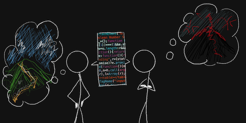

import Footnote from "../../components/footnote";
import AuthorCard from "../../components/authorCard";

This is undoubtedly the worst advice I have ever received as a software engineer: "_Code wins arguments_". I can see where the advice comes from. I have met people who would get stuck in endless planning meetings hypothesising about intricate systems without ever looking at the code. Then I have met very senior engineers who struggled to explain their ideas to their juniors where it was just easier to code up a proof of concept and continue from there. But for me this was the worst advice ever, because I never struggled with execution. It would be akin to advising an extrovert to talk more. They already are. 

## How I Got Into Trouble Following this Advice

I would like to tell the story of my biggest fuck-up in my career as a software engineer, and it was caused by this tiny piece of advice.

I was still a relatively junior engineer on the Web Release Engineering team at Facebook. We were in charge of the release of the entire web tier and as part of that was making sure that the monorepo would build correctly. Which, when you consider the size of Facebook's codebase, and how many engineers constantly contribute to it, is quite the feat. Often just reverting the offending pull request<Footnote presentation="0">or Diffs.</Footnote> would be sufficient, but sometimes, where the volunteers often struggled, it would require some additional changes to be made. Thing is, if you read the many pages of documentation, it was pretty straightforward... but who has the time to do that?

One week, during my on-call shift, there was an issue in the build that meant that this type of issue would occur multiple times a day. So, I wrote a quick script that would work on my developer machine and put up the PRs whenever it happened, so I could react to it faster, before the issue could worsen. Which led me to think, well, if I can script it, why can't we have a bot that does all of this, and puts up the PR for the person oncall to just verify<Footnote presentation="1">I saw this as necessary because I wasn't sure if the rule applied 100% of the time (it did, but it may not have in the future). This was still needed for compliance reasons. Only humans can commit code.</Footnote>. Then it's just a press of a button. This would come in extra handy at the weekend when people still submitted code, but the oncalls weren't actively watching for errors.

I was elated with my idea. This would take a massive bit off the oncall mental load, without a major impact on how quickly the problem would get resolved. It actually had the potential to make the resolution to be quicker. I ran it by the senior engineer on my team, and he shut me down. It was impossible. The technology wasn't there. I didn't dig any deeper, because I had already figured out how to do it. There was a new system that someone built that would allow it to do just that, I would just need to combine it with a few other things, and it would work. I tried to explain my solution, but the engineer continued to insist it was impossible. No matter "code wins arguments" after all. He would understand once I did it. Or so I thought... 

The next hackathon, I built it. And in the 2-day week we had for Easter I got it production ready. I was excited. I had achieved the "impossible", in 3 days. So, congratulations would be in order, right? Wrong. Shortly after presenting it, we shipped it. From that point on, that senior engineer made it his mission to be faster than the bot. Because that would prove it was useless. And he'd succeed occasionally, because he was watching the builds like a hawk in order to do it. I took it as confirmation that my bot worked as it was intended. He took it as evidence that I was not a team player and that I was not open to feedback.

As soon as I left the team, he turned off the bot and deleted the code. Thing is, the code, was never the problem. In fact, a year and a half later someone reached out to do that exact same project. I felt vindicated. But then what went wrong? 

## How the Advice Failed Me

I focused so much on the technical side of things I failed to see the human side. I did account for the user experience in order to optimise the time to resolution, but not how people felt. In all this, the advice I got from managers on how to resolve the conflict that arose with that engineer was "lead with curiosity". Combine that with the statement "code wins arguments", my curiosity became entirely technical. And you'd think that if both parties followed the same advice of code winning arguments, then the conversation would be about the same thing, so it would work. I would argue that it would just give more reason for the other party to hide what actually bothered them in the first place and try to make it about the technical issues, when it is not.

But I persisted, I enquired, asked questions... just not the right ones. I asked how to make the solution better. I would address every technical concern and, if there were any non-technical ones, I didn't even register them. While I don't think there were any voiced, at least not explicitly, I had no awareness to ask about them in the first place. But if they were mentioned, I blanked them out completely. After all the code was what mattered. 

## Hindsight is 20/20 and All that I Failed to Notice

If I had focused at all on the human element, the bot may have been able to survive my departure, and at the same time there's a chance it would not have been built at all. I cannot know. But I know my performance review would not have caught me by surprise<Footnote presentation="2">It wasn't a **bad** performance review, but it definitely wasn't the "Redefines Expectations" or at least the "Greatly Exceeds Expectations" I and some of my peers were expecting.</Footnote>. What this bot did, was that it took away a great source of dopamine from this engineer. Solving the build problems that required more knowledge than the average engineer would make him feel like a hero. My bot took that away. 

In addition to that, he already considered me too ambitious<Footnote presentation="3">He told me as much himself over drinks during a team offsite. How I was too ambitious, and he feels like he needs to compete with me. Mind you, he was at least 2 levels above me in seniority, I couldn't even understand why he would think that way.</Footnote>, and this bot became proof of the threat I was to his job. After all he was convinced that the bot was impossible. And not only did I prove him wrong, but I did it in 3 days. How's that for rubbing additional salt in the wound? I did it in 3 days because that was all the time I had. He saw it that I did it in 3 days because I wanted to show him off.

So what did I miss? Well, apparently everything that actually mattered.

## Code is Rarely about Code

It took me a while to learn this lesson, but this event set the ball in motion for me to get here eventually. Code is rarely about code. In fact, I could go as far as to say that code is never about code. Code doesn't exist in a vacuum. We don't write code for the sake of it<Footnote presentation="4">I know that is not entirely the case. I have met people who write code just for the sake of it. It's eerie.</Footnote>. We write code to solve problems, for people. Complicated, messy, regular people. This is the main reason I am not too worried about AI making software engineers redundant. The researchers who may be the closest to pure coding for coding's sake, work too close to the edge of innovation for the LLM to be useful. As for the rest of us, we need to decipher human egos, business needs, human behaviour... all the ambiguity we need to [disambiguate](/blog/disambiguation/). Computers for all their qualities, do not deal well with ambiguity... not that humans do...

In order to resolve people's problems, we first need to take the time to fully listen and understand what their problem is. Just because we think a solution we "brilliantly" found should solve their problem, doesn't mean it does. Take a page from the book of a good salesperson's. Listen to their problem first, don't try to convince them that your solution is the answer to all their worries. It won't work. Then if what you're selling would actually help them, offer it. If not, politely step away. That time spent listening, chances are they'll remember you or it.

Like in coaching, even when the solution is obvious, the barriers to getting people to accept the solution are rarely about the solution. They can be pre-existing faulty belief systems. They could be that they need time to process the information and come to terms with it themselves. It could be that there are other motivations and conflicting beliefs or requirements that we or they may be unaware of. Show someone a tool that turns their entire job into a button press, won't they be right to be scared for their livelihood? Of course, they would. Even if it wouldn't actually threaten anything, as there are so many other responsibilities it frees them up for. But getting there... that's not a straightforward journey. 

## What I would have done differently?

Honestly, I don't know. I know that I should have done things very differently, but how... I still don't know what could have resolved this specific situation. But at least I have enough evidence that I now can recognise that I am dealing with egos and threat responses and not technical disagreements. That in itself is valuable, even if it doesn't give me a magical solution. 

Am I still sour that my self-proclaimed-brilliant solution wasn't recognised? Yeah, absolutely. And not only that, but it was used as a weapon to undermine all the rest of the hard work I had put in that year. So, of course, I would still have feelings about it. I do think about it from time to time, maybe I will have finally learned something that unlocks the solution to that particular problem... But thus far I've got nothing, and I think I never will<Footnote presentation="5">After all, how do you argue with someone who doesn't believe in the moon landing?</Footnote>.

<AuthorCard/>

---

0 or Diffs.

1 I saw this as necessary because I wasn't sure if the rule applied 100% of the time (it did, but it may not have in the future). This was still needed for compliance reasons. Only humans can commit code.

2 It wasn't a **bad** performance review, but it definitely wasn't the "Redefines Expectations" or at least the "Greatly Exceeds Expectations" I and some of my peers were expecting.

3 He told me as much himself over drinks during a team offsite. How I was too ambitious, and he feels like he needs to compete with me. Mind you, he was at least 2 levels above me in seniority, I couldn't even understand why he would think that way.

4 I know that is not entirely the case. I have met people who write code just for the sake of it. It's eerie.

5 After all, how do you argue with someone who doesn't believe in the moon landing?