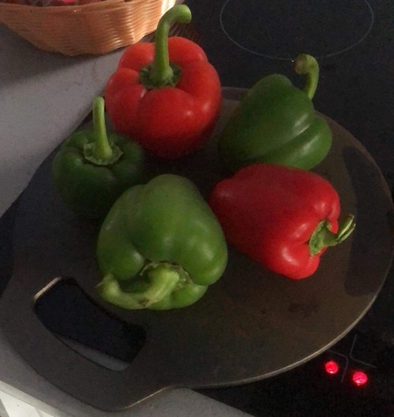
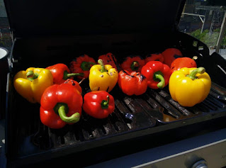
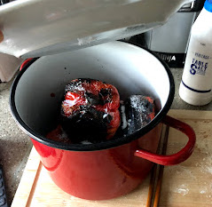
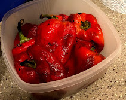

Roasting peppers is an essential method of cooking peppers in Romanian cuisine. September - October is pepper season in the Northern Hemisphere, and this is when my grandmother would buy a LOT of peppers to roast and prepare, and put into preserves... or just eat as is, as a side, with a drop of vinegar to serve. 

# Set up
What to roast on is the hardest bit here. There is no limit of how many roasting surfaces you can have at once, obviously the more surface are you have the faster it will go.

## I have a grill, outside
If you have grill, outside, you are in luck as that is the easiest, fastest, and most comfortable way to do this. Otherwise, let's look at alternatives.

## I have a gas hob
This is the second fastest way. Here I would not worry much about what you would roast it on, just prepare for it to be sacrificed... forever. Initially when starting to do this I just used a cheap metal (not non-stick) baking tray that ended up a bit warped. You can always use a thinner frying pan

**Warning**: do not use a teflon pan, the teflon will melt.

## I have an electric/ceramic hob
I've tried using a pan, with a ceramic hob, but that turned out to be insufferably slow. What I found to work very well, was a cast iron flat piece of metal. You can find it marketed as a Welsh Cake Pan or Baking Stone.

**Warning**: do not use a teflon pan, the teflon will melt.
## I have an induction hob
I haven't really investigated this, but my understanding is that cast iron works on induction hobs, so that may be safe to do. If you do try this out, feel free to message me.

# Other tools & ingredients
## Prepare:
- A **large pot**, (think pasta pot) which you should put the peppers in. 
- A **large plate** that will properly close the pot. Note: I would not use a lid, as modern lids are designed to let moisture escape, which would defeat the purpose of keeping the lid on.
- A considerable amount of **rock salt** 
- **Peppers** (I recommend getting cooking peppers, or how they are marketed in some supermarkets: wonky or imperfect - you can get more bang for your buck, and it doesn't matter if the peppers are big and pretty. Your life will however be considerably easier if the peppers have a stem)
- Your **roasting surface** of choice
- A thick kitchen towel to turn the peppers with you don't mind getting dirty. **Note**: you can use tongs here, but you must be VERY careful not to pierce the peppers, otherwise the juices will spill, and the peppers will dry up.

## Method
### Part 1:Roasting the peppers
1. Peppers, red and green, on a welsh cake pan on a ceramic stove

3. Roasting the peppers is a fairly simple process. Once we have our surface heated up we put the peppers on, with sufficient manoeuvring space and let them do their thing. Personally I would rather err on the peppers being a bit more charred than not being roasted enough, otherwise peeling them is too difficult.
4. Make sure you've gotten all the sides. 
5. It is safest to use the kitchen towel to turn them round on all sides. 

### Part 2: What to do with a fully roasted pepper
When a pepper is fully roasted it will be black on all sides (the black should cover most (90%) of the surface). Grab it, quickly remove the plate-lid, and put it in the pot. Make sure to quickly put the plate-lid back on. Every layer or so of peppers I would scatter a handful of rock salt. The salt and the moisture will help get the skin to unstick, and keeping the lid on will keep the heat in (the peppers are not fully done cooking, but as such they will be cooking themselves).

## Part 3: What to do when the peppers are roasted
Wait for a while, they should cool down naturally, while the lid is still on. Then we start peeling them. They should be still warm, but cool enough to comfortably handle. You will notice that the skin will come right off if you apply the minimal amount of pressure.

The difficult part here is not the process, but making sure you have indeed got all the peel. You should not put them under water under any circumstances as the water will wash away a lot of the flavour.  However it is ok to have a bowl of water in which you clean off your hands occasionally. 

If you are just going to serve them as is, this will be enough. However if we are going to cook with them, something like [zacusca](/food/zacusca/), we will need to remove the core. Here, it is also important that we remove the seeds... but again, it is not ok to put them under water to do so.

This is a recipe my grandmother would often cook, especially in late autumn. It was a lot easier to make than Sarmale, albeit using the same filling, so since sarmale was my favourite dish, this was an easy crowd pleaser. The recipe deals with the filling and the stuffed peppers separately. The amount of stuffing would vastly depend on the amount of peppers you have and the size of the pot you can put them in. However the filling freezes very well, and can be used at different points, without going through the more arduous process of making it.

