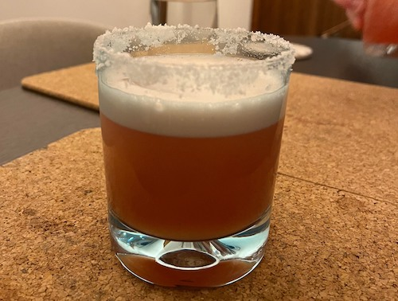

I've had a cocktail similar to this at a fancy restaurant, and I was disappointed. The presentation was poor (everything thrown in), and the tastes didn't mash, so I made this attempting to make it better, by changing the presentation, the base alcohol, and probably the proportions (as I had to guess).

## Ingredients
Note: I am using American shot measures, as that is what happens to be the measure in my cocktail set.
- **Tequila**: 2 shot 
- **Campari**: 2 shot
- **Fresh lime juice**: 1 shot, and a bit extra for the rim
- **Pineapple juice**: 6 shot
- **Honey**: 1 squeeze
- **Ice**: large preferable
- **Salt**: for the rim

## Instructions
1. Prepare the glass by wetting the rim with the lime juice a little, and then salting it. (the wet will make the salt stick) Then put in one ice cube.
2. Put ice in your cocktail shaker, then pour in the Tequila, Campari, lime juice, pineapple juice and honey.
3. Shake it all up real well, the shaker will be nice and frosty.
4. Pour the mixture into the glass through a strainer. It will be nice and frothy.

