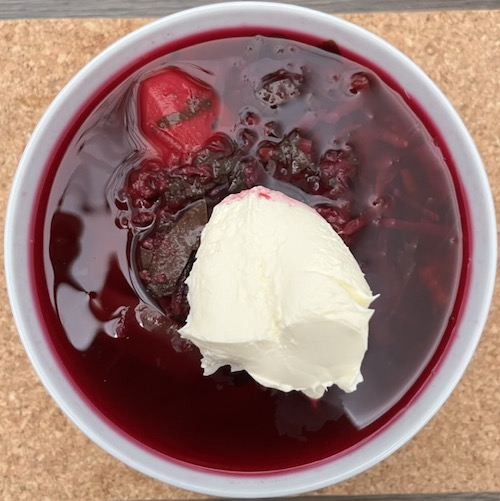

Bors comes in many shapes and sizes. This one is a personal favourite of mine. While it can be served hot (and it is in Russia), I personally prefer it cold. It is serverd with creme fraiche which makes it pretty and pink when served as well as delicious.

## Ingredients
Note: I have had to make certain modifications in order to adapt this recipe to ingredients I can find in the UK

Makes approx 7l of bors:
- **Bors**: 1 bottle - can be found in mediteraneean shops or [online](https://alimente.co.uk/produs/olympia-bors-leustean-1l/) 
- **Onion**: 1 medium
- **Helga beans**: 1 bag (approx 180g)
- **Pepper**: 1 (optional)
- **Swiss Chard**: 1 pack (approx 180g)
- **Parsley**: 1 bunch
- **Beetroot**: 500g
- **Carrot**: 2 medium carrots
- **Salad potatoes**: 1kg
- **Salt**: to taste, min 1 tablespoon
- **Creme Fraiche**: for serving

## Instructions
1. Chop the onion, helga beans, and pepper, if using, and put them in a large pot with water, and get it boiling. Do not fill the pot all the way as it will be hard to tell how much water is too much, I usually fill it 1/3 of the way at this point. Add some salt.
2. Chop the chard and parsley finely, set aside in a bowl
3. Peel the potatoes, carrots and beetroot.
4. Grate the carrots and beetroot, and put them aside in a bowl. If you have a juicer but not an automatic grater, you can juice them instead, the pulp will go in when the grated carrots would otherwise go in, but the juice will go in at the end - lest it looses the pink colour.
5. Chop the salad potatoes in biteable pieces. It is important to use salad potatoes, as they reliably retain their shape and not get crumbly. New/Baby potatoes are also a good replacement.
6. When the water is boiling and the onions have become soft and translucent add the chard and parsley in slowly.
7. Once it's reduced in size (the chard will be massive, but as the steam gets to it will turn small), add the potatoes. Now you can add more water, leave space for an additional approx 2l (the bors and the beetroot + carrot)
8. Once the potatoes are mostly soft (can poke them with a fork), add the beetroot and carrot. 
9. Leave it for another 5-10 minutes, so the potatoes get soft, then add the bors.
10. Bring to boil, and let it boil vigurously for a minute.
11. Let it cool down and store in the fridge. Then you can serve with creme fraiche once it's cool (you can mix it in slowly, but for presentation purposes I left it on top)

