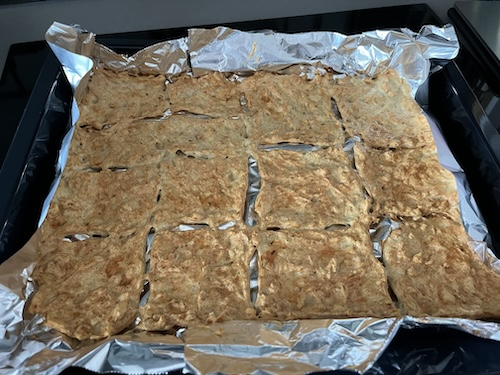
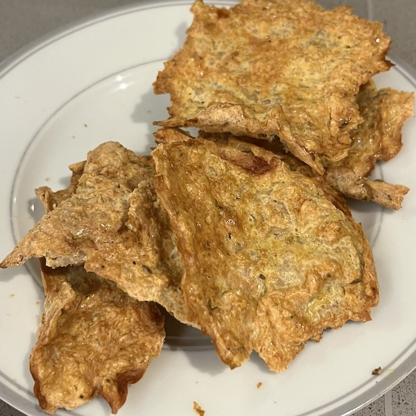

This is a recipe I had as an idea after seeing someone make tortillas from chicken. Why not make some crisps to snack? After experimenting a bit with fat contents, condiments, and timings I have reached the perfect snack that keeps me going back for more. And you know what the best part is? It's got a lot of protein, and is relatively low calorie. Perfect for a gym rat like myself.

## Ingredients

I would say that this makes about 2 servings, but I have little self-control when it comes to this snack.

- **Eggs**: 2 (large)
- **Minced chicken**: 500g (I use the supermarket own brand one that is 5% fat)
- **Seasoning**: salt, white pepper, thyme and sweet paprika
- **Butter**: for the non-stick

## Instructions

1. Preheat the over at 200 degrees Celsius on Fan.
2. Put aluminium foil in a baking tray. Grease the foil with a very thin layer of butter. While you can skip the butter, but it makes it a lot harder to remove the crisps off the baking foil/tray, regardless how non-stick the foil is advertised to be. I have tried using oil before however it blends with the mixture and does not help. As the butter is solid, it is more effective.
3. In a bowl add the seasoning (I use salt, white pepper, thyme and sweet paprika, feel free to experiment, but I do believe the salt to be a necessary ingredient), the two eggs and the mince and mix well. I use my hand to ensure as smooth of a blend as possible.
4. Pour and distribute the mixture on the tray. Try and get it as thin as you can.
5. With a tool or just your fingers create channels like a grid to separate the crisps. Or you could leave it as is and have one huge crisp...
   
6. Put the tray with the mixture in the oven and leave for 40 minutes. Optional, but you can open the oven during that time a couple of times to let the moisture out.
7. Take the tray out and turn the crisps over.
8. Return the tray in the oven and leave for 10-15 minutes. (15 minutes may be necessary if the mixture is a bit thicker - you should have a fairly hard texture - almost dehydrated)
9. Let the crisps cool off for a bit and enjoy.
   

## Dietary information

This is a rough estimate using the nutritional information on the specific ingredients I use:

<table>
  <thead>
    <tr>
        <th>**Chicken Crisps**</th>
        <th >&emsp;**1 Serving**</th>
        <th >&emsp;**Whole Recipe**</th>
    </tr>
  </thead>
  <tbody>
    <tr>
        <td>**Calories**</td>
        <td >&emsp;362</td>
        <td >&emsp;724</td>
    </tr>
    <tr>
        <td>**Fat**</td>
        <td >&emsp;14.8g</td>
        <td >&emsp;29.6g</td>
    </tr>
    <tr>
        <td>&emsp;**of which Saturated**</td>
        <td >&emsp;4.3g</td>
        <td >&emsp;8.6g</td>
    </tr>
    <tr>
        <td>**Protein**</td>
        <td >&emsp;54.8g</td>
        <td >&emsp;109.6g</td>
    </tr>
    <tr>
        <td>**Carbohydrates**</td>
        <td >&emsp;1.6g</td>
        <td >&emsp;3.2g</td>
    </tr>
  </tbody>
</table>

## Serving suggestions

I usually just eat them as is as a snack. However, they also go great instead of crisps or nachos to dip in things like Guacamole.

## Storage

Store in the fridge in an airtight container or zip-lock bag. While they are ok straight out of the fridge, I prefer to refresh them by putting them on in the over for 5 minutes at 200C Fan.
