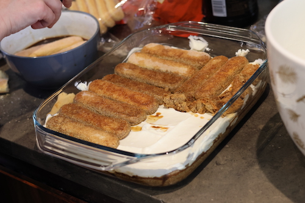
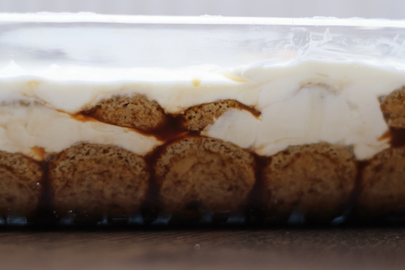
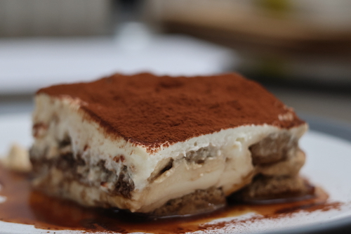

This is a recipe I have adapted somewhat based on one shared by a coworker. To me this it the perfect ratio. Find a [note on the reasoning the ratios down below](#Ratios). This recipe needs to be prepared one day in advance to serving.

## Ingredients
Makes approx 10 servings, depending whom you ask. These instructions are for a tiramisu that fits in a 35x23, 2.9L Pyrex Rectangular roaster.
- **Egg whites** (pasteurised): 150g; I prefer to get them in a carton, pre-separated, and pasteurised
- **Sugar**: a pinch
- **Mascarpone**: 500g
- **Double Cream**: 250g/300ml
- **Savoiardi biscuits**: 3 small packs (also known as ladyfingers or sponge fingers)
- **Coffee**: aprox 3 moka pots of 6 cups each
- **Rum**: liberal
- [optional] **Tia Maria**: liberal
- **Cocoa powder** - for presentation

## Instructions
1. Make your coffee and let it cool in bowls. Moka pot coffee has the best intensity for tiramisu, and some people swear by it being the only way to make coffee for tiramisu. While I have tried making tiramisu with V60 coffee before, the moka pot was indeed somewhat better.
2. Put the egg whites in a bowl (if you want to use full eggs, it would be 2 eggs), and whip them to [soft peaks](https://www.youtube.com/watch?v=zhuRyq7NrcA).
3. In a different bowl put the double cream and a pinch of sugar, and whip it, until the whisk leaves nice trails in the cream. Add the mascarpone and continue mixing.
4. Fold in the egg whites and incorporate them into the cream softly, until it's one soft, mostly homogenous mixture.
5. Take the bowls with coffee, we'll only use one of them for soaking sponge fingers in (if there's too many it's hard to handle before they soak too much and disintegrate), and use the other as a refill. Add the rum to the coffee. I like to add Tia Maria or Kahlua (coffee liquor), as it intensifies the coffee flavour.
6. Take out the serving bowl. Soak the sponge fingers in coffee and place them in one layer on the bottom, covering as much as possible, but not squashing them to fit. Fill the whole bottom of the bowl.
7. Pour half the mixture on top of the biscuits, and spread it evenly. To obtain a smooth, thin, even finish without crushing the sponge fingers below, I like to spread it slowly, through repeated motions back and forth. Similar to how one uses a brush to paint.

8. Repeat steps 5 and 6 until you reach the top of the bowl. Most of the time it will just be two layers.
9. Cover it in cling film and leave it in the fridge for a day.

10. Cut it up in portions to serve. Sprinkle some cocoa powder on top for a classic look when served (if you do it before the cocoa will get soggy). Other options for presentation could include chocolate shavings. 

## Ratios
- **Sugar/Savoiardi biscuits**: the biscuits themselves come covered in sugar. While this may differ from brand to brand, or may not happen if you make the biscuits themselves, in this recipe I use shop bought biscuits. I have used both Morrison's and Sainsbury's own brand, as well as Matilde Vicenzi.
- **Coffee/Savoiardi biscuits**: I personally like my biscuit soggy. I find that the Matilde Vicenzi biscuits are a bit more porous and absorb the liquid differently, and I occasionally over soak them more often than the british supermarket own brand ones. There's often a bit of coffee leftover, but better more than less. A dry biscuit in tiramisu really ruins the experience.
- **Double cream/Mascarpone**: Mascarpone is technically a cheese, as such it is fattier and heavier than double cream. Adding more double cream, and less mascarpone makes for a less fatty cream, but looses some of the taste (it's basically whipped cream). However having only mascarpone can make the cream too heavy and cheesy.
- **Egg white/Cream**: The egg white is fluffy as such it lightens up the cream mixture. Without the egg white the cream is too heavy. If whipped and folded the egg white retains some of the air that is incorporated, making the cream fluffier. 

