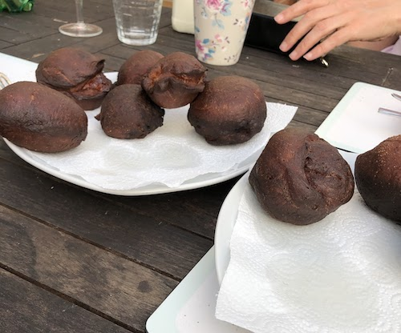

Krafle or crafle were a special kind of doughnut my grandmother would make for me every now and then. Sadly this was one of the recipes that I was not really able to find. I did however find the recipe in Sanda Marin’s book. I made them however they didn’t taste quite the same. I experimented a bit and discovered what the changes I needed to make were. Note: my grandmother always made them plain.

## Ingredients
- **Plain flour**: 500g
- **Sugar**: 50g
- **Butter**: 50g
- **Egg yolks**: 5
- **Yeast**: 25g(*fresh*) or 12.5g (*dry*)
- **Salt**: 1/2 teaspoon
- **Rum**: 1/2 shot
- **Whole milk**: about a cup (as much as the flour takes)
- [Optional] **Jam or marmalade**
- **Lard** or **oil** - to fry in
- **Vanillated sugar** or **powdered sugar** - for dusting

## Instructions
1. Melt the yeast with a little warm milk and mix well with 2-3 tablespoons of flour, so as to obtain a poolish, about as think as cream. Leave it at a warm temperature to grow. This should happen quite quickly if the yeast is active so you can go on to the next step. 
2. Separately beat the eggs yolks with the salt then with the sugar. 
3. Put the beaten egg yolks in the kneading pot, add the polish and start kneading. slowly add in flour and  warm milk until all the flour gets incorporated. The dough needs to be soft but well knead. 
4. When the dough unsticks from the hand/bowl add the melted warm butter, little by little and the rum, kneading until you get bubbles. You leave it to raise in a warm environment.  It should grow about 3 times the size. 
5. When the dough has risen, you knead it again, to shrink it. On the table sprinkle some flour (as little as you can afford without the dough sticking), the dough gets split in two and spread on a thick sheet (about 1 cm).
6. Cut circles of about 6cm in diameter from the dough. My grandma would do this with a glass and I have continued the tradition.
7. [optional part] Put a blob of jam (make sure to drain the juice) with the help of a piping bag. Do the same to the other half of the dough, but now put the circles on top of the others. Make sure there is no flour in between the two circles. Then press the corners together. 
8. Cover the doughnuts and let them rise in their shape. They should be about 1.5x the size. 
9. Do the same with the leftovers until you have no more dough left.
10. Bring the lard or oil up to temperature. Make sure the temperature is right. The fat must be frying; if it's cold the doughnults will absorb the fat nd become heavier, if it's too hot they'll fry too quickly and be uncooked inside. 
11. Put the doughnuts in face first into the frying fat. Remove them as they become golden brown. 
12. When removing put on a metal grill to drain the fat. Then you can dust with vanillated sugar.