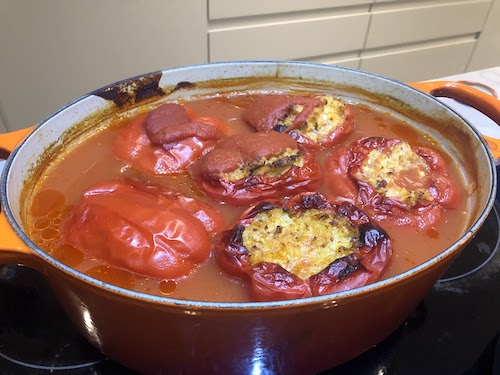

This is a recipe my grandmother would often cook, especially in late autumn. It was a lot easier to make than Sarmale, albeit using the same filling, so since sarmale was my favourite dish, this was an easy crowd pleaser. The recipe deals with the filling and the stuffed peppers separately. The amount of stuffing would vastly depend on the amount of peppers you have and the size of the pot you can put them in. However the filling freezes very well, and can be used at different points, without going through the more arduous process of making it.
##Ingredients:
###Filling:
- **Rice**: 2.5 cups (cleaned)
- **Salt**: to taste
- **Ground Pepper**: to taste
- **Thyme, Basil, Dill**: to taste
- [optional] **Ground carrot from juicing**: 1-2 tablespoons
- **Ground pork meat**: 1kg (go for the fattier options)
- **Onions**: 6-7 medium-large, approx 1kg
- **Oil**: for an initial fry of the onions
- **Water**

### Peppers
- **Tomato Passata**: 1L 
- **Water**
- **Peppers**: see how many would fit standing up in the pot you would use.
- *[optional]* **Large tomatoes**: 1-2
- **Creme fraiche** - for serving

## Instructions

### The filling
1. Chop onions into small pieces.
2. In a large sauce pan add oil, to cover the bottom, and bring to high temperature.
3. Add onions into pan. Stir so the onions don’t burn.
4. As they start to fry a bit, add salt and ground pepper to taste. If available add ground carrot pulp from a juicer. (This is entirely optional, but it gives it a slightly sweeter taste) This should be 5-10 minutes.
5. Then add water to the onion and boil until the onions are cooked so soft you can break them apart by softly prodding them with a wooden spatula. [Adjust water as necessary] The water doesn’t need to have evaporated as the rice would absorb the excess. This should be around 40 minutes.
6. Add the rice and let boil for a little while, just long enough that you would be able to eat it. — it will cook a lot more later, so it doesn’t need to be soft. This should take about 10 minutes.
7. Add the herbs. I quite like using a combination of wild thyme, basil and dill. Where the thyme is the primary herb. I remember my grandma using fresh dill and sometimes, more rarely parsley, finely chopped up. 
8. Take it off the heat and let cool down. 
9. When it’s cooled down add the ground pork and mix well. I would get my hands in and mix it properly.  

### The Peppers
1. Get a large pot, preferably with a lid. These can be made on the stove but I find the over to be lower risk, and overall less risky about burning them on the bottom
2. Take the peppers and remove their cores. Make sure to keep them intact, otherwise, there should only be one hole through which to fill them up.
3. With a teaspoon fill up the peppers with the filling made above. Don’t force the stuffing in too much, as the rice will grow and the filling may overflow.
4. Place them vertically (with the hole at the top) in your pot. Do not stack them.
5. If you have a big tomato cut it in slices, and you can use them as lids for the peppers. (You can also do this with tomatoes if you core them properly, but there’s as skill to that I have yet to decipher)
6. After you’ve filled your pot, it’s usually best if the peppers are sitting snug one next to another, pour water, just to reach the top of the peppers. 

7. Bring to boil and then transfer to the over, at roughly 170/160 Celsius, for 2-3 hours.
8. If you have a lid, leave it on, but with a bit of a gap for the steam to escape.
9. As the water level goes down, replenish it with tomato passata. 
10. For the last half an hour, fully remove the lid and let the sauce reduce for a bit.
11. Serve with creme fraiche. 

