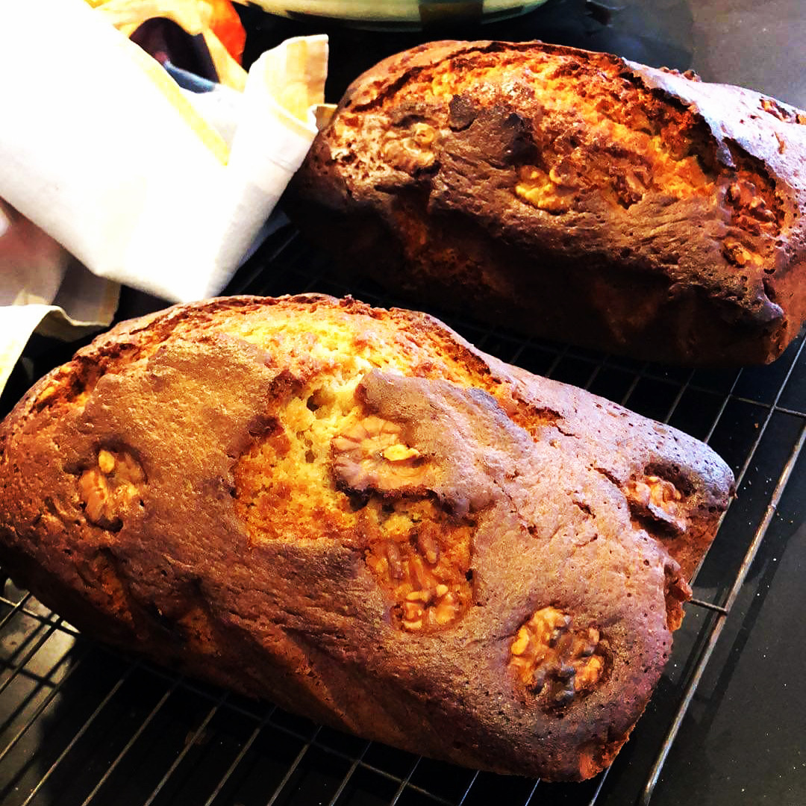

This is one of the fast recipes my grandmother would make for me as a kid. I would often have it for breakfast with a glass of milk. This recipe makes two loaves.

## Ingredients
- **Eggs**: 8 whole
- **Sugar**: 2 cups
- **Sunflower oil**: 2 cups
- **Honey**: 4 spoons
- Zest of one **lemon**
- **Vanillated sugar**: 14-21g *(if none can be found, vanilla extract will do)*
- **Cinnamon**: 1 teaspoon
- **Chopped walnuts** - to taste
- **Self-raising flour**: 250-300g
- A pinch of **salt**
## Instructions
1. Separate the eggs
2. Beat the egg whites with the salt until the beaters leave trails on the top (soft peaks)
3. Slowly add the sugar and vanilla/vanillated sugar, keep beating the eggs at top speed
4. Move the mixer to slow and add the honey and the egg yolks, slowly.
5. Add the lemon zest, slowly mixing add the flour and cinnamon.
6. Add the oil slowly, careful not to bust the bubbles out.
7. Add the walnuts, mixing slowly. 
8. Now pour the mix (it should be soft), into two loaf trays, which have been pre-lined with baking paper.
9. Put it into the oven at 180-190 Celsius. 
10. Bake until browned, you can check it’s done by inserting a wooden toothpick/cocktail stick into the loaf and seeing if it comes out dry and clean.
11. Let it to cool underneath a tea-towel before serving.
