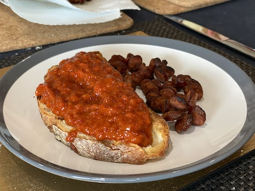

This was absolutely the favourite thing for me to have across the year. Grandma would make it in autumn and then we would open a jar every now and then across the year. There are multiple ways to make zacusca, some containing fish, some containing eggplant, but I never quite liked them as much as the classic pepper one. Traditionally it would be made with gogosari, a Romanian variety of pepper, but I have found it to work well enough with bell peppers.

## Ingredients (to be used as ratios)
- **Red Peppers**:  5kg (uncooked weight) - if you have pointed peppers add a mix of those
- **Sunflower oil**: half a litre
- **Mustard**: 2 tablespoons (sweeter or dijon)
- **Tomato Concentrate**: 300-400g (200g is enough for double concentrate)
- **Vinegar**(9°): 1-2 tablespoons
- **Salt, peppercorns, bay leaves**: to taste - if you use [my method for roasting peppers](/food/roasted_peppers/), the peppers may be salty enough
- **Honey**: around 100g, to taste
## Method
1. First, roast the peppers, peel them and remove the core. [Here is a guide on how to do that](/food/roasted_peppers/). This can be done on separate days, and I recommend that.
2. Put the peppers through a meat grinder. Do not use a food processor, as it will turn them into a paste. I do reckon with enough patience you can mince them sufficiently with a knife.
3. The ground peppers should go into a sauce pan. With a good non stick sauce pan I've had less work to do than would otherwise be necessary.
4. Add the oil, mustard, salt (if needed, the peppers could be very salty depending on how much salt they absorbed while resting after being roasted),  a teaspoon or so of pepper corns, 3-4 bay leaves, the vinegar, the tomato concentrate, and at least 2 tablespoons of honey. 
5. Now mix them a bit and let on a low heat to simmer until it reduces to a thick paste. (approx 2-3 hours)
6. In this process, if not using a good non-stick saucepan, you will have to stir a lot so it doesn't cake on the sides of the pot. 
7. Taste after an hour to see if it needs more salt or honey. The honey is variable as the peppers can vary greatly in sweetness.

## Storing
You will need jars. I recommend some with popping lids, as they will let you know when the preserve is too long. Make sure they are very clean, dishwasher clean is enough, provided there's nothing caked on, on the glass.

Here you have two options: if you want to store them in the cupboard or in the fridge. In the fridge is easiest as you will only need to put the mixture in jars, close the jars and let the jars cool overnight before putting them in the fridge. 

If you wanted to store them in the cupboard you would have to properly sterilise the jars before putting the zacusca in them, to do that put the jars without the lids in the oven and get to 100 degrees. Pour the zacusca in and return the jars to the oven to reach boil in the jars. You will need to be careful when pouring the zacusca in and closing the lids, so as not to burn yourself, as the jars will need to be hot. 

## Serving
Open a jar and just serve. If storing in the cupboard I would put the zacusca in the fridge the night before as it's a bit tastier cold. Serve a thick layer on bread.

