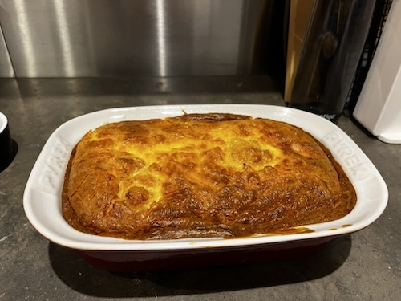

This is meant to be a very simple recipe made from cauliflower and cheese. The assembly is fairly quick and it takes about 45 minutes in the oven, where all you need to do is wait. It is definitely a personal favourite.

## Ingredients:
- **Cauliflower**, florets: 1 big head/750g in florets approx
- **Creme fraiche**: 1 big pot (500/600 ml)
- **Cheese** (*mild cheddar*): 1 large pack (~ 400g) - grated
- **Eggs**: 3
- **Flour**: 3 tablespoons (peaked)
- **Salt**: to taste - depending on cheese saltiness

## Instructions:
1. Pre-boil/steam the cauliflower in floret form, to a medium soft texture.
3. Mix together the grated cheese, eggs, creme fraiche. 
4. Add the flour, and mix well.
5. Add some salt, it depends on how salty the cheddar is (with Lye Cross Farm mild cheddar I still need to add a small teaspoon of salt or so).
6. Put the cauliflower in a heat proof container/bowl.
7. Pour the mixture over the cauliflower.
8. Put the pot in the oven at 160 on Fan (preheat it to this temperature for best results).
9. Leave for 45-60 minutes. To test if it is done: use a toothpick/cocktail stick, poke the cauliflower, and if it comes out clean then it is done.

