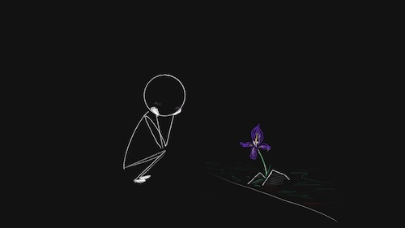

import Footnote from "../../components/footnote";
import AuthorCard from "../../components/authorCard";

If my previous posts([1](/blog/gym_crush/), [2](/blog/gym-like/)) about my gym crush didn’t give it away, while I am perfectly happy to declare my crushes to the internet, I am an absolute chicken in real life. I could tell myself that I am just being considerate... but that's a lie. 

It's actually because I don’t want to be an inconvenience, a nuisance, a bother... I acted as if the fact that I liked this person would be the actively disgusting to them<Footnote presentation="0">Yes, I admit there is some history there, with those exact words, and some others...</Footnote>, and even if they wouldn't quite go that far, I would still make them uncomfortable. Which, obviously, isn't something I want. 

I thought this was a matter of self-esteem and getting over what my ex told me, and, as much as I worked on that, it only got me past the disgusting part, not the uncomfortable part. I still couldn't see that me letting it show I liked someone could be perceived as anything other than uncomfortable, even if I didn't really do anything about it. No wonder I would constantly feel anxious about whether I smiled a bit too wide when I saw my crush or accidentally looked at him a bit too long... Never mind the anxiety I felt over the mere possibility of ***\*shock\**** ***\*horror\**** talking to him, not even confessing or anything, just making conversation like a *normal* human being.

It was one line from Erich Fromm’s [Escape From Freedom](https://www.goodreads.com/book/show/25491.Escape_from_Freedom) that made it finally click for me. 

"*The result of this is often a profound fear of love on the part of the child when he grows up, as “love” to him implies being caught and blocked in his quest for freedom.*"

I am the child. And naturally, I also assumed my view was universal. Therefore, not only is love a burden, one I may choose to take on as it may be worth it for me, but it is a burden on others too, one which they may not choose to take on, therefore I should not "force" upon them. Challenging this view in myself as well as others released all the anxiety I was feeling<Footnote presentation="1">About this thing in particular, I am still an anxious overthinker, worry not. How else would I write all these posts?</Footnote>.

## Love as a Burden

To delve deeper into the quote and the context in which it appears, Fromm talks about the sadistic or domineering relationships people form. Relationships that we often call love. The "love" that offers the child/partner anything they may (physically) need or sometimes desire, as long as they abide by the rules set by the dominant/sadistic individual. This particularly affects children as they are taught they can only receive their parents' love conditionally, if they behave exactly as they are required, or they excel either athletically or academically... 

But that is not love. The sadistic parent is just fulfilling their psychological need to release their anxiety caused by this uncontrollable world by controlling the child. Yet somehow, that is seen as love, because that control can be generous. After all they are putting a roof over the child's head, ensuring they never go hungry, they may even get them the best education... But, ultimately, the child is not allowed to develop as an individual with their own needs and wants. All they are allowed to focus on is the expectations set on them by their parent and how to fulfill them. And sometimes those expectations could be indeed grand. And one can find themselves never being [enough](/blog/enough/).

Still, that parent calls that love. And that's the only perspective that child is taught. No wonder that child's view of love gets twisted. And despite it all, the child still desires love, of course they do, they are human. But there is burden linked to that love. If I were to combine it with attachment theory, in the avoidantly attached it may show as the love being a burden on them, but for the anxiously attached it might very well be perceived as a burden on the object of their love. And then we have the jackpot of disorganised attachment, like myself, who jumps in between both. 

Reading that sentence by Fromm, I couldn't help but ask myself: "Do I see love as a burden?" and unfortunately, once the question was uttered, the answer became an obvious and resounding **yes**. For the very reason he stated in that very section.

## Love as a Gift

Loving someone is like a gift in many ways. And there are people who don't know how to love in the same way they don't know how to give gifts. 

The gift may be something the person is "supposed to like" instead of something that they would actually like. In the same way that people may sometimes love others exactly and only like they would want to be loved, and be unable to comprehend that someone may need or want to be loved differently.

Or the gift may have certain expectations from the person who gifted it. Sometimes explicit, sometimes not. And like the [white elephant](https://en.wikipedia.org/wiki/White_elephant), it becomes a burden. Similarly, in love, that love then comes with expectations in behaviour for the object of their love.

Sounds burdensome all around.

However, gifts are not supposed to be burdens. They're meant to be gifts. Once you give a gift, it’s theirs to do with as they please. They may return it, they may take it, like it, keep it or throw it away. After all it is theirs. And if a gift is truly given as a gift it's the act of the giving that makes the giver happy. 

I worked with my therapist a bunch on this. Getting me to just accept gifts. Comfortably. Not looking for the angle. Not worrying what is expected of me in return, if it was too inconvenient for them to get it for me, whether they would be hurt if I don't like it... that maybe I didn't thank them hard enough... Because gifts like love were burdens in the past. But that's not everyone. 

A "thank you" in return is nice, but to me the thank you is what I need to release the anxiety that the gift may have been wrong and fully enjoy that I gave something that they appreciated. I don't get to dictate how they appreciate it. Though I do tend to give gifts when I encounter something that makes me think of that person, I don't need to be proven right in my judgement that they indeed enjoyed it. 

## The Joy in Loving

So why not treat love the same? After all I am allowed to like/love someone. And there's a lot of joy I derive from that. In just seeing them... And just like a gift, they don't need to react to it, they don't need to like me back, interact with me beyond what they are comfortable... they don't need to do anything, just exist.

I agree with Fromm that love is an action. And a state of being. Loving someone is not a desire to possess them, for that is what needing them to love us back is. Love and like are a source of joyful emotions. To use the same example of the flower Fromm used in his choice of two poems of [Goethe](https://poemsintranslation.blogspot.com/2010/12/goethe-found-from-german.html) and [Tennyson](https://en.wikipedia.org/wiki/Flower_in_the_Crannied_Wall), I can like a flower and not feel the need to pluck it and take it home. Maybe I just spend a little more time on my walk to pass it by and admire it. The flower doesn't need to like me back, after all it can't. But that doesn't, or at least shouldn't, diminish the joy I feel whenever I see the flower. 

I noticed that after reading that part I was finally comfortable letting my smile show when I was around my crush. I just allowed myself to feel happy and not guilty about the joy I felt just seeing him, or saying hello. 

That is the love that heals. And the beautiful thing is that it is the act of loving itself that heals, not necessarily getting that love in return, but more on that in my next post.

<AuthorCard />

--------
0 Yes, I admit there is some history there, with those exact words, and some others...

1 About this thing in particular, I am still an anxious overthinker, worry not. How else would I write all these posts?