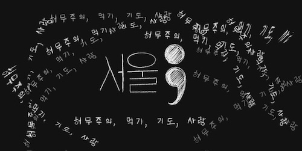

import Footnote from "../../components/footnote";
import AuthorCard from "../../components/authorCard";

I didn’t think I’d ever publish this. I wrote it in my notes, for myself, because I needed to get my feelings and thoughts in order. Not sure what triggered it, but the thought hit me all of a sudden on my evening walk. The post sat in my head all through my walk and I couldn't sleep until I wrote it down. I looked at it later and decided there was no way I could ever publish it. It was too raw, too much information, just too much. Nonetheless, I kept stalling on my other drafts, because this was calling back to me. It felt too important, and like I was betraying myself if I didn't publish it, even if in an edited version.

It started with a feeling that hit me from nowhere. Maybe it was reading [A Matter of Life and Death](https://www.goodreads.com/book/show/57595476-a-matter-of-death-and-life), maybe it was being told for the Nth time that I was brave for moving to Seoul alone when it wasn't true, or maybe it was just my brain telling me something important it finished processing. Like an alert of a thread that finished doing its computation. For the first time in 20 years, when I learned what death was, I feared death. Not in the "_I didn't get to finish my novel yet_" way or the "_I don't want to go through the pain of death_" way, but the "_I want to live_" way. 

When I told my best friend I will go to Bali for a month then move to Seoul for at least a year, she joked that I am doing my _Eat, Pray, Love_. She wasn't entirely wrong, though I am not searching for any kind of spiritual enlightenment. And I wasn't counting on necessarily finding happiness along the way. While I may have been searching for something, I decided for once to just follow my feelings and not focus on the destination.

## Nihilistic
For the year after the break-up of my 7-year relationship and more or less loss of my career<Footnote presentation="0">They're not entirely unrelated, but that's a long story.</Footnote>. I was low. My entire life disappeared in a matter of weeks. I have never been someone to give up easily, and putting in effort comes like an instinct to me. But all my effort was never enough. I felt hopeless. Yet I didn't know how to stop putting in the effort. For the next year or so, I was more or less on autopilot. Sleeping 12 hours a day, dealing with legal battles, sending application after application in the peak of tech layoffs, doing interviews that only ended in ghosting, even after an offer was made, struggling to stay in London, all for a semblance at the life that made me miserable in the first place. I didn't want to live, but I didn't even have the energy to arrange that, so I just let myself operate on autopilot. 

There was a book that kept me going: [Life for Sale](https://www.goodreads.com/book/show/43685241-life-for-sale) by Yukio Mishima. In it the protagonist, after a failed suicide attempt, decides to make a post to offer his life up for sale to people to use how they please. After a series of increasingly strange adventures, the character realises he wants to live. The moral of the story is: if you don't want to live, it's because you don't want to live the life you are currently living. It kept me going. But it took me another year to actually be able to do anything about it. In a "Fuck it!" moment I booked a 1-month trip to Korea with a week in Kyoto. There was a strong pull to go again since my first trip November 2023. I think there were less than 3 weeks notice on the trip. I promised myself no job applications, no talking to recruiters, just focus on myself. After all, I was miserable in London anyway, it was never a city I chose, it just happened to be where my job was. If I was going to be miserable anyway, at least I could be miserable somewhere nicer.

Of course, Seoul didn't magically cure my depression. There still were a couple of days where I only slept, ate and hiked the same Namsan trail. But from the moment I landed in Incheon, I knew I was where I wanted to be, nay, where I needed to be. By the end of the trip I decided. If nothing mattered anyway, why not move to Seoul? The next roughly 6 months I spent on figuring out the how. I remembered that being in Korea has been something I wanted since I was in high school, it just wasn't something I thought was even possible, so I never even considered it. But it could be, now. I had been in Seoul twice. I could make it possible. And if nothing I try is working out anyway, might as well let it not work out in a place I actually want to be. I had my runway, which would only get longer in Seoul, and even if it didn't work out, my Plan B was not going anywhere. It was comforting. 

## Eat
If you know me, you know I am a foodie. Both cooking and exploring restaurants. Being able to always recommend a good restaurant for anything in London, is a big part of who I was. Seoul is amazing for that, though it shook me up a bit at first to have start over from 0, but it was also exciting. Aside from my simple breakfasts, I’ve eaten out for most meals since arriving here. It made sense financially for me as when I cook, I cook. But it also gave me the chance to explore. But I found myself drawn to the same food places.

The strange thing is, if you look at what I have been eating in the last couple of months it does not look like the food diary of a foodie at all. I have been basically eating the exact same thing. And with the heat in the past month, I have cut down to breakfast and a lunch-dinner with some protein and fibre snacks in the middle to be able to meet my macros. Around food, gym, language learning, and my writing I had built a routine<Footnote presentation="1">This list doesn't include my coaching as that is too chaotic, and too dependent on other people.</Footnote>. This routine has become the sustenance of my life. I still try and make weekends a bit more social, and times differ as I want to allow myself to wake up naturally, but for the most part my week has a pattern to it that it's never had before. I thought I hated routine... But I have reached a balance I am happy with. Even if that means I eat the exact same chicken breast salad every day. Hey, I actually like how they grill the chicken. It's not monotony, it's grounding. It doesn't mean I don't go out for something more interesting when I feel like it, or I am going out with other people. I feel like I can more properly enjoy the special moments that way. 

Am I just trying to challenge myself to get to the point I have visible abs? Yes, maybe, I want to see if I can do it. But if I am getting there, it will be with routine, without denying myself the occasional treat. If I was cooking for myself, I would count every gram and every calorie, and not allow myself anything that deviated, and maybe get a bit too fixated. Eating out, I may have the routine, but the margin of error allows me the mental flexibility to be kind to myself in the process. I’m comfortable, and even if things change later, I know I can keep what’s essential for my health, just maybe at different times.

## Pray
While I would not describe myself as an atheist, as I see that as just another religion that focuses on the belief that there is no god, [I don't believe in religion](/blog/perfection/). Much less praying. If I visit a temple, it will be for the architecture. Bali, a place that is supposed to be this calm oasis of [relaxation](/blog/relaxation/) turned out to be my personal hell. So much so that I changed my flights to the earliest possible date to come to Seoul. 

That being said, I do have great appreciation for individual non-secular teachings. While I am not and never will be buddhist, I do enjoy their teachings. In a way, language learning has become my own spiritual journey. It just so happens that it is partially through a text from a Buddhist monk, 완벽하지 않은 것들에 대한 사랑. 

Despite Romanian being my native language, and my main language until I went to university, nowadays, English is by far my primary language. It's the language I had my therapy, the language I was able to explore myself in. It's a language I can express myself in freely. But this was something I built up gradually. While I don't expect myself to ever reach the same level of fluency in Korean, I am curious how I will end up expressing myself in this language that I am learning as the adult I am today. I am learning it starting from the things that are important to me, instead of focusing on the academic side. From being able to survive, to expressing what is important to me. Why else would I choose a somewhat philosophical text to be my first reading? I thought it would be the perfect one. I read it in English (in a very poor translation<Footnote presentation="2">Don't get me started. The translator didn't even have the decency to keep the chapters in order. It's literary vandalism, that's what it is!</Footnote>) first, and I thought that it was a great little book summarising a lot of my learnings over the past years. Can't say it's easy, but doing a page every day has become a bit like a prayer. This alongside my near-daily journaling in this language that is still so foreign.

I feel like there is a certain spiritual exploration of the self in learning a language. Things often don't translate 1:1. And Korean is the most different language I have ever learned. It's a challenge in both finding the words to express myself, but also forces me to see my own thoughts from a completely different angle. And sometimes that's just what we need, to examine our lives from a different angle. I know I probably read/sound weird to a native speaker... But I am finding the ways to express myself. One step at a time. In the last year, I have also learned how to express my needs, and be true to myself. And like with Korean, it's still a work in progress. I am only at the beginning.

## Love
While there is a [crush](/blog/gym_crush/) over here, and due to my own [cowardice](/blog/gym-like/) there has been no resolution, this section is not about that. I mean, I wouldn't mind if it was, but alas... Anyway there is one more important love in my life, and that is me. For the first time in my life, I am learning what it's like to love myself. I think people underestimate how rare this skill is. It's not something easy to learn if you are not shown it. As they say "_if you are not fed love with a spoon growing up, you'll learn to lick it off the edge of a knife_". I think I am [just now](/blog/fiction/) at the age of 31 starting to grasp what it looks like. Spoiler alert: it's not all the evangelised self-care culture we see nowadays all over social media. It can be, but if it's not true to yourself it won't help.

This came from a place of nihilism too. These blog posts, I know not many people read them, but I write them for myself first. I put in effort to make them good, by my standards, not for my 15 readers, but for myself. They need to meet my standards, not somebody else's. I put effort into coaching not because of the results, but because I want to. Otherwise, I would have stopped trying a long time ago. I take myself to the gym and watch what I eat, so I am the one who thinks I look good in the mirror, not somebody else. I go to the theatre because I want to and it makes me happy. I put effort into Korean because I want to understand more<Footnote presentation="3">Ok, I'll fess up. On this one my crush is extremely effective motivation too.</Footnote>, even though there are plenty of people who have been able to get by for years without it. I am in Seoul because I want to be here, not because of a job<Footnote presentation="4">Actually the job market here is not that great...</Footnote>, university, or anyone else. Over the last 6 months, I have chosen myself with every decision. And the thing is, with practice, like with building muscle, it may be small and gradual, but with consistency there is progress. And what is love if not choosing yourself or the person you love?

## Seoul 

I don't know if it's because of Seoul that I got where I am, but it is definitely the catalyst that allowed this to happen. If I can figure out my visa situation, I know I want to stay in Seoul. Because I want to live here. Because I want to live. I no longer have my Plan B. The mere thought of it makes me terrified now. I think it's dropped off the list altogether, which, to me, is the clearest sign I’m doing well. Even with all the challenges, I want to see where this goes. I have something to work towards that I know that I, not anybody else, want. Not having a safety net, regardless how bleak the safety net is, may be a bit terrifying, but I hope it turns out to be the good kind of fear. My eat, pray, love was not an escape. But a search for meaning in the meaningless. Am I suddenly an existentialist? Nope, still a nihilist, just one that is looking forward to seeing what happens next. And this thought, is my confirmation that I have found meaning in the meaningless, even if it's nothing distinct. 

<AuthorCard />

--------
0 They're not entirely unrelated, but that's a long story.

1 This list doesn't include my coaching as that is too chaotic, and too dependent on other people.

2 Don't get me started. The translator didn't even have the decency to keep the chapters in order. It's literary vandalism, that's what it is!

3 Ok, I'll fess up. On this one my crush is extremely effective motivation too.

4 Actually the job market here is not that great...

