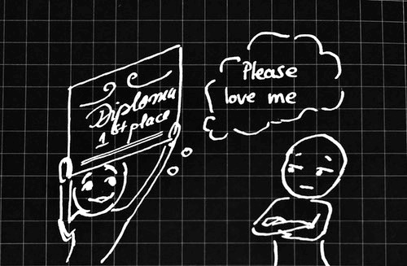

import Footnote from "../../components/footnote";
import AuthorCard from "../../components/authorCard";

This one is for all of us who have never really experienced being enough growing up. If our parents don't teach us we are enough, this will come to haunt us later in our adult life. And we have to do the hard thing and teach ourselves. This is the story of how I am learning to be enough.

Growing up I was never enough. There was always the next competition. If I didn't rank first, we focused on what I could have done better. There may have been a small celebration, but ultimately my mother's philosophy was if I allowed myself to rest or celebrate I would fail<Footnote presentation="0">The Romanian literal translation would be "_hit your snot into the beans_", thought I'd share as it's one of those absolutely hilarious Romanian expressions.</Footnote>. I vividly recall getting my acceptance letter to Oxford and my mother being upset because I chose not to apply to any American universities, because I was going to accept the offer. My entire childhood was guided by my need to please my mother. Oxford was my rebellion, if one can call that a rebellion.

This need to please and do better all the time transferred into my adult life too. I would constantly chase the next achievement, the next stage in the relationship. And I had pretty high standards, at least at work. I didn't know how to function otherwise. Some of my coworkers may disagree, but some would undoubtedly agree that it made me pretty difficult person to work with at times. While my standards for others were much lower than for myself, that prevented me from accepting them for who they were.

And this feeling of never being enough, was the only way I knew how to exist. So, it's no surprise I ended up in a relationship where I could never be enough, no matter how hard I tried, how much I dismissed my needs, or how much I shrunk myself. Because that was all I knew.

## My Baby Steps to Feel Enough

My standards for others were much lower than they were of myself, so I started there. After all, that was a shorter road to travel. Others were rarely enough too. While I may not have realised it at the time, because I didn't know how it felt to be enough, how could I properly see other people as enough either? There are probably two parts in seeing others as enough.
1. **Radical acceptance**. Accept people as they are and that they are not going to change. That is up to them. This was the hardest for me. Because I would always focus on potential and not what someone actually was.
2. **Define the expectations**. If I have a relationship with that person which allows for this, express my expectations of them. This doesn't mean forcing them to meet them. But evaluating them on expectations that they have to guess is not fair to them, nor does it set them up for success. I should know, the expectations I had to meet were never verbal, always shifting, often contradicting. It's constantly reading the room, watching out for an explosion. It's exhausting. Clearly setting my expectations with a person is key. For myself, to keep me honest, but for them too. They can choose to meet them or not. What we do after that is a different question.

## You Can't Chase Dreams You Don't Know
Like we need to define expectations with others, we need to define expectations with ourselves. These may be our standards or our dreams. But if we constantly chase a dream we haven't defined, that dream will only grow bigger. Lifestyle/Goal creep is real and if we aren't careful we end up being unhappy with having achieved goals old us wouldn't have even thought possible. 

So, let's define what enough looks like. Imagine the perfect happy life, and every detail about it. Who is around us? What are we doing? What have we done? Where do we live? Do we have a partner? How do they treat us? Anything that is important. Let's write that down. Preferably with numbers where appropriate.

A year ago, in June 2024, I sat down in a café in Kyoto<Footnote presentation="1">If you believe in signs from the universe, after sitting down in this random café that served canelé, my favourite dessert, I realised all the staff was Korean...</Footnote> and wrote down everything that I wanted from life, my career, my friends, my partner, my hobbies... All filling up a little notebook. From small things like "I will have AC in my house/flat"<Footnote presentation="2">I handle heat terribly and this is genuinely a requirement</Footnote>, "I will be able to bench my body weight", to bigger goals like "I will keep writing as something I do for myself, and never accept an advance to write a book", "I will publish a book", "I will have a partner who loves me and loves to show it whenever possible."...

In the process, I realised the things I was holding onto that were not important to me. And the things that were important to me, but I had given up on. When I got back from holiday, I got into the coaching course, almost by chance, but I knew what I needed now, and I was sure it ticked all my boxes. Now, even if I fail to make the freelance coaching business sustainable, I will not regret trying. But, I can confidently say all of this, because I have a little notebook that helped me define what is enough for me. Now, I can chase and keep the things that are good for me.

## When Loyalty is Good

I was loyal to a fault. It would take quite a lot for me to leave a place or someone. I was like a lost puppy who didn't want to be abandoned, so it could never abandon anyone or anything. That made me just flail harder to make things work that were never meant to work. 

It would take quite a lot for me to give up. I thought I would be working for Facebook for my entire life after my internship there. But, things happened that I could not get over. And eventually, I went to therapy. So I moved. And then I moved again<Footnote presentation="3">Not always out of my own choice. I write a bit about that [here](/blog/fired/).</Footnote>, and again, and again. My CV does not look like that of a loyal person, but none of the places I was at met my needs, and unfortunately for them<Footnote presentation="4">And my ex.</Footnote>, therapy started teaching me about self-respect and boundaries<Footnote presentation="5">The audacity...</Footnote>.

I don't think my loyalty is inherently a bad thing. I just needed to learn how to only be loyal to the right people and the right places. And what I define as right here is enough. In other words, do they align with my needs and dreams. If I know what my needs are, I can easily make a judgement. If I don't, I may keep always looking for something better, thus throwing away something good and my happiness in the process. Some may disagree with me as statistics state that the solution to the [Optimal Stopping Problem](https://en.wikipedia.org/wiki/Secretary_problem) is to say no to the first 37% of options, and then pick the first one that is better than the ones you rejected. But this implies not knowing what you need. If you know what you want/need you can just stop at the first place that meets all those needs. 

Is my gym the first one I walked in? Yes, after some thorough online research, but the vibe was great, it had everything I needed, and my PT is knowledgeable, responsive, and is able to help me improve. I am happy there. I didn't need to go to 10 gyms first just to pick this one. Not that I couldn't have returned after checking some others, of course. 

**Caveat**: Sometimes our needs change over time. That's ok. This doesn't make one disloyal. It may mean a change in careers, countries, gyms... Pretending they don't is like going to a pediatrician your whole life because they are a good doctor. Yes, they are, but children stop being children after a while.

## When Enough is Not Available

Sometimes enough is just not available when you are looking. Here there are two options: 
1. Walk away, and wait until you find good enough. Easy to do with a job, when you still have money in the bank, but not so much when you don't. 
2. Analyse all your standards, the reasons behind them and figure out for how long you can make it work. And write it down. 

Sometimes analysing the reason for the standard makes it go away or morph into something more true to ourselves. For example, I grew up thinking I should only date taller men, but that was never something conscious, upon further analysis I realised I just disliked men who were insecure about their height and would put their girlfriends down for wearing heels and actually same height is the best height for hugs. Sometimes the standard remains, but we can compromise on it for a finite period of time, if certain other things make up for it. That is a personal choice. But write that down if you will compromise your standards for something, because once you do it, you want to be able to remember it. Then there are some standards that are not worth compromising on. Then we need to walk away or have our escape plan ready.

But if we don't know what our standards, goals and needs are, we may have compromised on them long before realising.

## Being Enough

<iframe src="https://giphy.com/embed/iywuVpIJRzbUI" width="480" height="206" frameBorder="0" class="giphy-embed" allowFullScreen></iframe>

I have reached a point where I stopped entertaining people in my life for whom I would never be enough. With that, I then only had my own voice to deal with when I felt like that. And step by step, standard by standard, things are changing. It's not a linear path, but slowly I am learning to be enough. Even when it's hard. Even when I want to achieve more. But here's the thing, being enough and allowing myself to be more... they're not opposites, quite the contrary. Knowing that I am enough, allows me to take the risks to try and be more. Because then, even if I fail... it's ok. And then, the fear of failure has just a little less power.  

<AuthorCard/>

--------
0 The Romanian literal translation would be "_hit your snot into the beans_", thought I'd share as it's one of those absolutely hilarious Romanian expressions.

1 If you believe in signs from the universe, after sitting down in this random café that served canelé, my favourite dessert, I realised all the staff was Korean...

2 I handle heat terribly and this is genuinely a requirement

3 Not always out of my own choice. I write a bit about that [here](/blog/fired/).

4 And my ex.

5 The audacity...