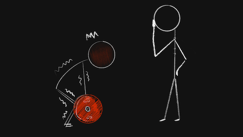

import Footnote from "../../components/footnote";
import AuthorCard from "../../components/authorCard";

# Lessons from the 헬스장

Recently, my PT has been trying to teach me when to fail. His most recent struggle with me is that I keep going even it is obvious to everyone and myself I am struggling and can't safely make the weight anymore. My counter to him was that he kept counting, so, of course, I would keep going. I am not sure if he realises just how much he hit the bullseye on something I am bad at doing, in general. Not just bad, **extremely bad**. My personality is such that I keep pushing and pushing… until I get to my goal… losing track of the cost, usually to myself. And if I get to the goal, I keep moving the goal, because clearly it wasn't hard enough.

## What Happens When I Don’t Fail

In the context of the gym, when my PT keeps counting, I keep going and going and going, past the point where I should fail. I would feel the muscles I was training hurt, so, I would make small adaptations to push through. If muscle 1 can’t do the thing, I can add a little of muscle 2 to compensate, so I can finish my set, "_successfully_". By the end muscle 2 is doing most of the work. At this point muscle 1 is no longer being worked out, and the exercise has lost its meaning. I would lose track of why I was doing it in the first place, and focus on completing it, at any cost. 

Now, there are some exercises, like the facepull, where compensating, with the rhomboid usually, just means that the rear delts are not being worked out. Perfectly safe, if a bit pointless. But other exercises, like the deadlift, where the weight is too much to brace properly, I'd bend my back to be able to lift it to the top. Here pushing through leads to an increased risk of injury. For what end? That poor lift ain’t impressing anyone anyway. Not that I am lifting to impress anyone... I lift because it makes me feel good, and I want to be able to continue to do it. Now, I can’t do that if I break my back with a terrible deadlift form, can I?

But muscles only grow when you push them to failure! Yes, and they get hurt if you push past failure, thus it’s important to know when to fail. Not too soon, but not too late either.

If I remove the weight terminology, I get to the exact same behaviours I have in my day-to-day life. I keep pushing and pushing, and lose track of why I was doing it in the first place, because the goal was set, and I just kept working hard, ignoring the signals that I was pushing past failure. Just because I still had some resources that allowed me to keep going, I would keep going. Whether it was a good idea or not.

## Why I Don’t Fail

Fail is such an ugly word, isn’t it? And if one grew up in an environment where failure was punishable, one may say it’s even a very scary word. It’s giving up, right? Kind of. When failure is punished, giving up is the natural consequence. Eventually it leads to not even trying because I fear failure, and when I do try, trying too hard, in order to avoid failure. 

I know some who may claim that punishment, and harsh judgmental talk upon failure will just motivate them to try harder next time, and it might for a while, because, after all, what it means is that failure is not an option. So, surely if you don’t stop you don’t fail, and you don’t get punished. And harsh self-talk **is** self-inflicted punishment.

Yet, when we look at the research nowadays, we have more and more evidence that harsh talk doesn’t actually help. In fact, it’s more likely to have failure be seen as something dangerous, which activates your sympathetic response, i.e. the fight-or-flight, or the lizard brain. When the sympathetic system is activated it is safe to say we are not at our best. 

So, when my PT kept trying to get me to fail, I had to think really hard about why the idea made me so uncomfortable. It’s because I saw failure as something dangerous and something within me was telling me, "_Oh, no, you don’t!_". 

## Getting Myself to Fail

Over the last month or so, I have been using the gym for more than just muscle training, but as failure practice. 

Do I still get it wrong and keep pushing myself past the point where I know I should have stopped? Absolutely! But, I think I have been getting better. And just because I didn’t fail, it doesn’t mean I failed<Footnote presentation="0">Yeah, I had to read that one twice too.</Footnote>. Sometimes I am just happy practicing the awareness of knowing when I should have stopped, whether or not I can bring myself to stop. 

I cannot help but look back on my life and notice the points where I should have failed early. Like the 6 years of a relationship that should not have lasted more than 3 months at best, with a man who took 3 years and an ultimatum from my therapist to tell me he loved me, and then cried over how difficult that was for him. Still that wasn't enough for me to admit failure. Had I known how to fail, my therapy bills would be significantly cheaper. Yes, I would still have needed therapy, after all it does take a special kind of trauma to see the above behaviour as acceptable. But at least I would have like only half the things to work through.

## The Timing of This Post

The timing of this post is not coincidental. I recently took a break from coaching in order to focus on taking the TOPIK exam<Footnote presentation="1">It was last weekend. And I managed to squeeze in a holiday along the way too, hence my post being slightly off schedule. I signed up "because I was curious" and "I would not care if I failed or not" and that is the biggest lie I have ever told myself... like... have you met me, or read my blog? I want to have done well... I was so nervous before, but now it's over, I don't mind if I did well or not. Sure I will be disappointed if I didn't, but it's not like I will stop learning Korean if I do, nor does it make my Korean ability any worse.</Footnote>. During that time, I scheduled all my blog posts, my form of marketing, and did nothing to get clients. While I was still stressing over the exam, and my visa, I realised the extent to which coaching has started consuming me. For example, I managed to watch a full episode of a K-Drama in one sitting for the first time since June, or May. And I picked up my fiction writing again. After all there’s only so much language learning one can do in a day, for it to still stick.

This was my first break since January. And it helped me realise I had been pushing myself past failure. I conveniently forgot that I had decided that if I do not make my hours for my certification by September I would consider it a failure, after all I was so close. Additionally, the reasons I was pursuing coaching as a career in the first place, as something rewarding that doesn’t consume me and still leaves me time and energy to focus on my hobbies, were nowhere to be seen. The only thing that I had promised myself I would keep doing that remained was the gym, and that, to me, is as essential as sleep. So, after going on a theatre ticket shopping spree, I paused and did some thinking… and research.

As I have been learning to get better at failing at the gym, I think it is time to test it in real life, and fail at coaching. If I look at the data, the choice seems too obvious to even be called a choice anymore. I know that in the past I would have kept pushing, finding more and more ways to make it work, or at least seem like it is working. Of course, this doesn’t mean I will have lost all that I have gained along the way. It also doesn’t mean my coaching will come to a full stop. I still have the skills, and if there are people who will approach me for coaching, I will still happily employ those skills. But I will be putting a close on this chapter, the energy I put into keeping it going, and start looking for the next. 

## What Failure Looks Like

At the moment, not much will outwardly change, but my mindset will. While I will still coach my existing clients, and anyone who may approach me about it, my focus will shift to finding _good ol’ regular_ jobs, in Seoul. I will look something that allows me to continue using my coaching skills, and if I can use my technology skills too, even better. And if I need to learn new skills along the way, I will. 

I know I can’t do the 996, nor do I believe anyone really can… at least not for long, and I want something that will be sustainable, the start of a longer chapter. For that I do not want to rush. I don’t know what exactly that looks like, because I don’t want to zero in on a goal quite yet. It could look like teaching, it could look like engineering management... it could look like something I haven’t even considered yet. 

When I left tech to try some other things, I never considered in the beginning I would do a certified massage therapist course<Footnote presentation="2">Funny story, I actually never finished the certification process for this because it required me to massage at least 36 different people multiple times and write case study reports, and I discovered I really really dislike touching people I am not close to, and, alas, I do not have 36 close friends. Not that that realisation in particular was a surprise to anyone who knew me.</Footnote>, nor get certified as a coach. And I most certainly didn’t imagine I would end up in Korea, which still feels like a dream. So, for now, I will be sitting with the failure, take what I can learn from it, and work with the uncertainty to see where it all leads me. 

Failure is not giving up, and it’s not a bad thing. It’s just stopping at the right time. And the right time, to use the gym metaphor, is when you stop training the muscles you were supposed to be training in the first place. How can that be a bad thing?

<AuthorCard />

--------
0 Yeah, I had to read that one twice too.

1 It was last weekend. And I managed to squeeze in a holiday along the way too, hence my post being slightly off schedule. I signed up "because I was curious" and "I would not care if I failed or not" and that is the biggest lie I have ever told myself... like... have you met me, or read my blog? I want to have done well... I was so nervous before, but now it's over, I don't mind if I did well or not. Sure I will be disappointed if I didn't, but it's not like I will stop learning Korean if I do, nor does it make my Korean ability any worse.

2 Funny story, I actually never finished the certification process for this because it required me to massage at least 36 different people multiple times and write case study reports, and I discovered I really really dislike touching people I am not close to, and, alas, I do not have 36 close friends. Not that that realisation in particular was a surprise to anyone who knew me.