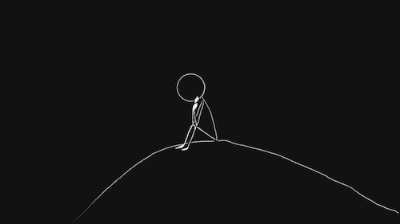

import AuthorCard from "../../components/authorCard";

About 4 years ago, I got my cPTSD diagnosis from a psychiatrist. I had gone in for an ADHD diagnosis, but the cPTSD was the more obvious diagnosis. Only once the cPTSD was "cured", would they then be able to assess for ADHD. But how could they, when, by their own admission, there is no way to cure cPTSD, just ways to manage it? I felt pretty hopeless. Even finding a trauma specialised therapist was difficult. So, I sunk into reading. 

Pete Walker's book, cPTSD from Surviving to Thriving, is probably still the most comprehensive text I have read. Still, it offers few answers. Just methods to cope, not cure.

How can we hope to cure something when we don't fully understand the root cause? In fact, one of the chapters in Pete Walker's book is dedicated to how often it gets misdiagnosed. Unlike PTSD, it can't even be linked to one root cause event, though, as I will go on to explain, the event itself does not cause the PTSD. Even now, there are a lot of unknowns in this field. It's only recently that a study6 from Germany has looked at how BPD is in fact rooted in trauma.

Current literature suggests that the cause of PTSD of any kind is the lack of love and support we got when dealing with a difficult event. I believe what makes cPTSD so enduring is not just what happened to us, but what we lost because of it: our faith, as defined by Eric Fromm. In ourselves, in others, and in love. 

## What makes capital T trauma?

Gabor Mate has a fascinating talk about how not all traumatic events cause cPTSD or PTSD. While all soldiers go through the same war, not all of them are affected the same way. Some Holocaust survivors never got PTSD from the horrors they had to face. Not all rape victims deal with PTSD as the result of their experience. These are all undeniably traumatic experiences. But not everybody comes out of them in the same way. 

In his book, The Myth of Normal, he says “*Trauma is not what happens to you; it is what happens inside you as a result of what happens to you.*”2. He further emphasises the importance of community in the person's capacity to withstand adversity. Ultimately, how we are met, and held by the community, is what allows our wounds to heal and not turn into a Trauma. In other words, if we are met with love, be it brotherly, parental or romantic love, we are better able "*To take the difficulties, setbacks, and sorrows of life as a challenge which to overcome makes us stronger, rather than as unjust punishment which should not happen to us, requires faith and courage.*"1

Being held with compassion helps us maintain trust in others, and in ourselves. That trust is the foundation of what Fromm calls faith. The quiet belief that life, work, and love are still worth doing. Thus, when we are met with love, it is either that it prevents the trauma from destroying our faith, or provides with so much faith that it helps make up for the faith we lost.

## Then what causes Post Traumatic Stress Disorders?

What if we were to define Trauma with a capital T as trauma in the absence of love? Then, it will come as no surprise then that in the treatment of affairs, the Gottman Institute references the observations made by Shirley Glass how the hurt partner often suffers from a PTSD reaction following an affair’s discovery. How can they not, if what they are experiencing is the withdrawal of love, further impacted by mistrust and disillusionment in the love of their partner? The same person whose love could and should have helped them with that pain. We lose trust and faith in that partner over the betrayal. And interestingly the hurt partner does not even need to have a shocking moment when they walk into the room to discover the affair. Simply being told is enough.

Growing up as a child of narcissistic or emotionally immature parents can leave the child with cPTSD if they do not have another loving presence throughout their childhood. The cPTSD then goes on to affect every aspect of their lives. 

"_It takes faith to bring up a child; it takes faith to sleep; it takes faith to begin any work. But we all are accustomed to having this kind of faith._"1 Only that these children who do not grow up with loving parents, are not accustomed this kind of faith. And we need faith in all the aspects of our lives. Later this makes them only more likely9 to meet an abusive partner that will further confirm that such faith cannot exist. Being robbed of this faith, we are robbed of love, and thus by Fromm's words "_the only sane and satisfactory answer to the problem of human existence._".

Interestingly, if we are to look at studies7,8 done on soldiers, there is also evidence that unit cohesion, morale and even humour are negatively associated with PTSD symptoms. This is also backed by historical observations that indicate that soldiers with strong camaraderie reported lower rates of combat related stress disorders. This strong camaraderie is love from the unit, and faith in the unit. That faith, as Fromm states, allows us to overcome challenges.

Because we were denied the love we needed, when we needed it the most, we lose faith. And without the faith we can't love further, not fully. It's not because we don't know how. But without faith, without freedom or trust, that desire to connect, and fawning, turns into a survival strategy.

## Looking at the Symptoms

Let's not talk about cPTSD as a disorder for a second. I, personally, like how Irvin Yalom, in both his books The Gift of Therapy and Love's Executioner, refers to the DSM as merely a way to describe a set of symptoms. So, let's look at (c)PTSD as a series of symptoms. 

Here's how Fromm describes the symptoms of lacking faith: "_Whoever does not have it, suffers from over anxiety about his child, or from insomnia, or from the inability to do any kind of productive work; or he is suspicious, restrained from being close to anybody, or hypochondrical, or unable to make any long-range plans._"1 

Sound familiar? Because at least from my experience, those all sound a lot like the symptoms of PTSD. Yes, they do manifest differently in different people, but the same hyper-vigilance, suspicion, insomnia (nightmares), and anxiety is present. And I, for one, most certainly struggle to make long-range plans, because I do not trust the world would remain sufficiently similar to be worth making long range plans. 

The inner critic, one of the more ever present symptom of cPTSD, is there to work as an atheist preventing any faith in ourselves from developing. Is it then surprising I struggle with self-love? How could I not? After all, "_Love is an act of faith, and whoever is of little faith is also of little love._"1

Therapy has only offered me ways to treat different symptoms. But no way to gain what I lost. Neither the therapist nor I know what I lost, for I never had it. To me that's the difference between complex and regular PTSD. With regular PTSD there is a clear before state one would want to return to. With cPTSD there is not. 

Fromm's concept of faith allows me to reframe my cPTSD not as a pathology, but as a deeply human consequence of living without love. And in his chapter on the Practice of Love, suggests some solutions on how to grow that which will build faith and allow us to love.

## Admitting the fear

The lack of love where there should have been love is in itself a betrayal. With sufficient betrayal of the faith that we can be loved, we are weakened, "_and how increased weakness leads to new betrayal, and so on, in a vicious cycle. The one will also recognise that while one is consciously afraid of not being loved, the real, though usually unconscious fear is that of loving. To love means to commit oneself without guarantee, to give oneself completely in the hope that our love will produce love in the loved person._"1. That love that could have healed us, and we may desire above all -- I know I do, is also something we have become afraid of. Because love is loving someone fully without any expectations, but with faith that they will love us back. And now, experience has taught us this will not happen. Especially when we need it the most. 

So, how can we not be afraid to love? 

Most people are afraid of love, if we’re honest. But they have faith to give them the courage to love anyway. Courage, after all, only exists in the presence of fear. But for those of us with cPTSD, the faith is what’s missing. Leading to a life that is full of "intense anxiety, a feeling of not being firmly grounded in the world"1. We may turn to "masochistic" tendencies to escape the fear, not as an act of bravery, but one of numbness or survival. 

But if we admit to the fear? Not numb ourselves to it? But seeing it as a friend, to walk alongside?

## Feel the fear and do it anyway

We may not be able to build the faith Fromm talks about at the drop of the hat. We can't be told "have faith" and suddenly have it. But, if we admit to the fear we are feeling, we are not allowing it to make the decisions for us. It takes patience, the third factor of the practice of love described by Fromm. And patience requires at least a little faith that patience will be worth it, that there will be a tomorrow to be patient for. So, maybe that's a small enough amount of faith that we can manage to start with. For now, I can commit to the practices of concentration that Fromm talks about in his book. Discipline, not in the authoritarian sense, but as an expression of my own will. 

Faith will come. Faith in my own abilities. Faith in the people I choose to have in my life. Faith in my work and art. And faith in love. And with faith comes courage, and with courage comes love. And, whether or not, it cures my cPTSD, I do think it will get me closer to the life I want.

<AuthorCard />

--------
**References**

1. Fromm, E. (1956). The Art of Loving. New York: Harper & Row.
2. Maté, G. (2022). The Myth of Normal: Trauma, Illness, and Healing in a Toxic Culture. New York: Avery.
3. Walker, P. (2013). Complex PTSD: From Surviving to Thriving. Azure Coyote Publishing.
4. Yalom, I. D. (2001). The Gift of Therapy: An Open Letter to a New Generation of Therapists and Their Patients. Harper Perennial.
5. Yalom, I. D. (1989). Love’s Executioner and Other Tales of Psychotherapy. Basic Books.
6. Borderline Personality Disorder May Be Rooted in Trauma. (2021). Scientific American.
https://www.scientificamerican.com/article/borderline-personality-disorder-may-be-rooted-in-trauma/
7. Vaishnavi, S., et al. (2024). Unit Cohesion, Morale, and Humor as Protective Factors Against PTSD in Combat Veterans. Military Psychology, 36(2).
https://pubmed.ncbi.nlm.nih.gov/38661464/
8. Hutchison, M., et al. (2021). Social support and PTSD symptoms: A meta-analysis. Journal of Anxiety Disorders, 81, 102411.
https://www.ncbi.nlm.nih.gov/pmc/articles/PMC8101258/
9. University College London. (2025, January 9). Risk of domestic abuse increases over time in those exposed to childhood maltreatment. UCL News.
https://www.ucl.ac.uk/news/2025/jan/risk-domestic-abuse-increases-over-time-those-exposed-childhood-maltreatment
10. Healing From an Affair. (n.d.). The Gottman Institute.
https://www.gottman.com/blog/practical-science-based-steps-to-heal-from-an-affair/
11. Glass, S. (2003). Not Just Friends: Rebuilding Trust and Recovering Your Sanity After Infidelity. Free Press.