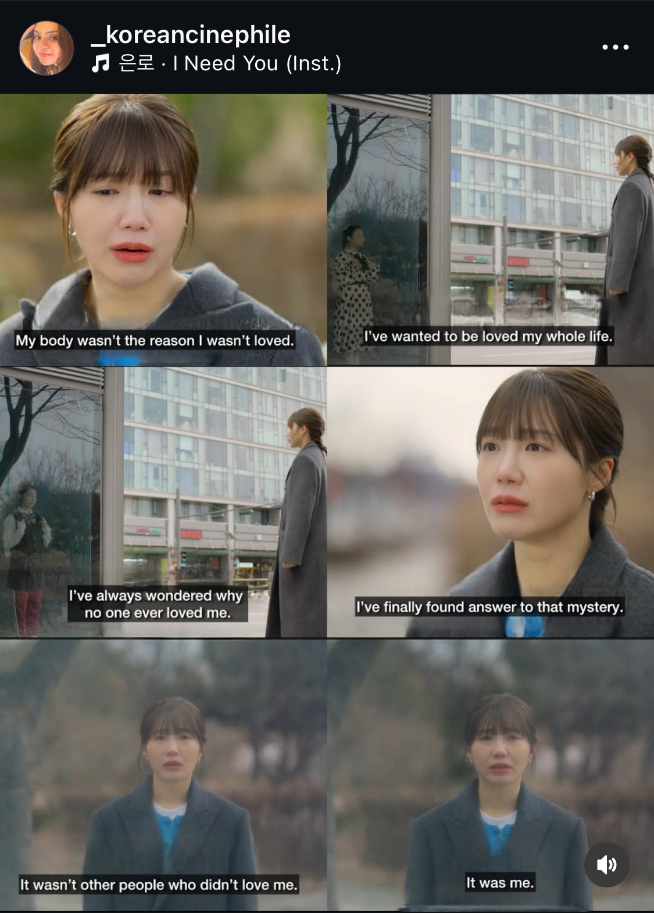

import Footnote from "../../components/footnote";

This week I learned more about self-love from a K-drama than I have from years of reading psychology and self-help books. I [touched on this before](/blog/mind-laundry/) when I talked about how the exploration of erasing memories had me thinking about how we can heal from memories. Overall, I am pretty sure I have learned more from fiction, be it a webtoon, a K-drama, or a book, than from any piece of non-fiction that I have read<Footnote presentation="0">And I have read a lot. Written by psychologists, philosophers, self help gurus, therapists and even religious leaders. Last year alone, I read 76 books, about half of which were non-fiction.</Footnote>. While that is not to say that the non-fiction wasn't helpful. It certainly helped me put a name to what I was learning and made it easier to use that knowledge.

## Show don't tell

Over the past two months I watched [24시 헬스클럽](https://en.wikipedia.org/wiki/Pump_Up_the_Healthy_Love). It was meant to be a light-hearted romantic comedy, a bit slapstick, about the gym. As a gym rat, how could I resist? But, in true K-drama fashion<Footnote presentation="1">Be it a K-trauma or a comedy...</Footnote>, the characters are what made it unexpectedly deep and healing. They touch on an essence of humanity.

What I loved most about this drama is that there are no villains<Footnote presentation="2">Though the female lead's mother gets pretty close. Who reacts like that over her daughter being hurt for being broken up with? Actually... Don't answer that.</Footnote>. The way the characters deal with their wounds, be it abandonment, or never being loved unconditionally... that is real. Some deal with them in ways that hurt or annoy others... some deal with them in ways that hurt themselves. Then, in the last episode, that 10 second clip about self-love, they deliver the conclusion... That hit more than any book on self-love I have ever read<Footnote presentation="3">And I think I have read most of the relevant books on the topic, from Kristen Neff to the Dalai Lama and Desmond Tutu.</Footnote>.

Why is that? Well, the leading piece of writing advice is "Show don't tell". Non-fiction is amazing at telling... but it often forgets to show. Whereas fiction takes us through the story of one or more characters and their emotions. They show us how it affects them, it shows us how they react, and it shows us what the consequences are. What we choose to take from it, well, it's up to us. But that exercise of empathy alone, of relating to them, is sometimes enough. If it's a happy ending it can model the decisions and changes we could make to get there ourselves. Not by telling us what to do, like every self-help book out there, but by showing us an option. 

## Good fiction stays with people because it rings true

One thing I despise is: people equating good fiction with serious, often dark, award-winning, hyperintellectual books. As if the only books worth reading are James Joyce's Ulysses<Footnote presentation="4">Still have not read it, and never intend to.</Footnote>... For a story to be good it only needs to be true. Not in the sense of the events actually happened, but the human element brought in being true. Hemingway's philosophy for writing when he was stuck was just to "write something true". And that is the key to good fiction -- Hemingway should know.

So yes. The greatest insights can come from all sorts of places. Be it romance novels<Footnote presentation="5">I learned a lot from these.</Footnote> or seemingly silly comedies. Some of the greatest insights in my life have come from comedies. As Terry Pratchett once said "The problem is that we think the opposite of funny is serious. It is not. In fact, as GK Chesterton pointed out, the opposite of funny is not funny, and the opposite of serious is not serious."<Footnote presentation="6">There is a reason the man is quoted in multiple economics textbooks for The Sam Vimes theory of socioeconomic unfairness.</Footnote> For a story to be good it needs to come from a seed of truth. And that seed of truth, is what draws me to a work. It's in the way the characters think and interact. 

Is all fiction good? No, I don't think so. Some is entirely created for the purpose of distracting and making money. Some stories are genuinely created by looking at the trends and writing something that matches them, with little concern for who the characters even are... if they even have a personality at all. But genre, or medium does not define a good story. It's the truth that goes into it that does.

## My most impactful pieces of fiction

I think this blog post would be incomplete without me sharing a highlight of the most impactful pieces of fiction I have read<Footnote presentation="7">At least the safe-for-work ones. The list would be double with those included.</Footnote>.
1. [Life for Sale](https://www.goodreads.com/book/show/58860812-life-for-sale) by Yukio Mishima
2. [24시 헬스클럽](https://en.wikipedia.org/wiki/Pump_Up_the_Healthy_Love)
3. [The Canterville Ghost](https://en.wikipedia.org/wiki/The_Canterville_Ghost) by Oscar Wilde
4. [Vicious](https://www.goodreads.com/book/show/13638125-vicious) by V.E. Schwab
5. [Iljimae](https://en.wikipedia.org/wiki/Iljimae)
6. [Kaleido Star](https://en.wikipedia.org/wiki/Kaleido_Star)
7. [Baldur's Gate 3](https://en.wikipedia.org/wiki/Baldur%27s_Gate_3)

I have chosen these because they had the strongest immediate impact as I had watched/read them. But almost every single work of fiction I have interacted with<Footnote presentation="8">Ok, I can think of some that haven't...</Footnote> I think has changed me in some way or another...

Mind you, this is not necessarily a list of my favourite works of fiction. That is a very different list indeed. They were the ones that I read/watched at the right time. There are works of fiction that I adored and years down the line I connected with the truth they showed. Sometimes through the help of another work of fiction. But their impact was cumulative. These I chose because they were very much in my face.

## What only fiction can do

I saw it said quite beautifully that reading is walking in the shoes of another person for a few hours, through the entirety of their story. We go through the life and story of a character alongside them. In a way fiction allows us to lead more lifetimes than ever possible on our short time on Earth. And in that time we gain experience. And with it emotional intelligence<Footnote presentation="9">This is not just anecdotal knowledge. Research shows that readers of fiction show higher emotional intelligence than those who only read non-fiction. [One such study.](https://pubmed.ncbi.nlm.nih.gov/24091705/)</Footnote>. With that emotional intelligence we can get more in touch with our emotions and our needs that they surface. Fiction shows us those emotions, how they feel or look like, so it's easier to recognise them. And when we recognise them, we start being able to handle them, not just react to them. Once we choose how we respond to a situation, then we can start making changes in our life to build towards the life that we really want.

Ultimately non-fiction is like learning the theory. But theory without practice is rarely helpful. The fastest way we can get that practice? Through fiction.

_I am an ICF coach and work with enabling my clients to reach their goals through growth. Feel free to read more about it [here](/coaching/) and book a free intro call to discuss what coaching can do for you._

--------
0 And I have read a lot. Written by psychologists, philosophers, self help gurus, therapists and even religious leaders. Last year alone, I read 76 books, about half of which were non-fiction.

1 Be it a K-trauma or a comedy...

2 Though the female lead's mother gets pretty close. Who reacts like that over her daughter being hurt for being broken up with? Actually... Don't answer that.

3 And I think I have read most of the relevant books on the topic, from Kristen Neff to the Dalai Lama and Desmond Tutu.

4 Still have not read it, and never intend to.

5 I learned a lot from these.

6 There is a reason the man is quoted in multiple economics textbooks for The Sam Vimes theory of socioeconomic unfairness.

7 At least the safe-for-work ones. The list would be double with those included.

8 Ok, I can think of some that haven't...

9 This is not just anecdotal knowledge. Research shows that readers of fiction show higher emotional intelligence than those who only read non-fiction. [One such study.](https://pubmed.ncbi.nlm.nih.gov/24091705/)