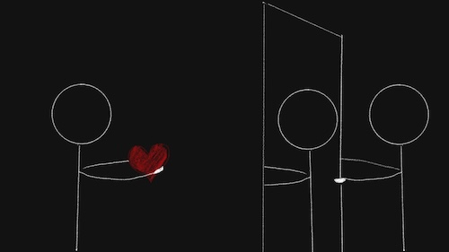

import Footnote from "../../components/footnote";
import AuthorCard from "../../components/authorCard";

I have always found it easier to love others, whether it was admiration, friendship, romantic love, or a combination of the above, seeing most people as inherently deserving of love was easy. As was seeing their qualities. Yet, thinking they may perceive me the same way, or share the same thoughts I may have had about them, was unthinkable. Still is a little, but I am working on it.

It's often easier to love others than it is to love ourselves. It's why I mostly disagree with the saying that we must learn to love ourselves before we can start to love others<Footnote presentation="0">I think the only leg that saying has to stand on is: if we do not love ourselves we may accept "love" that is cruel and undeserving of us. If we love ourselves, walking away when someone disrespects us, or acts cruelly towards us is easy. When we don't... not so much... As we feel we deserve it, and that is the exact rhetoric the abuser will echo to justify their abuse.</Footnote>. Thinking that someone may love us, knowing all our faults, especially when we were not loved by those who were supposed to love us, may seem like an impossible task. But, we can learn. Because we do and can love others, deeply. And the way we love others may show us the way.

Because love is an action. It is a choice to love someone, even when we feel like we have no way but to love them. In a secure attachment, two people can sustain the relationship because they both have a positive perspective of their partner. They choose to interpret their actions and intentions positively, because of that love. I see how easy that is to do when I like someone. Yet I don't do this for myself, my inner critic is all the happier to tell me how much of a monster I am over the smallest mistake. Though, it did need to learn that from somewhere... But if love is an action, we can choose to love ourselves. And the way we like someone else, may be just the model we need to guide us.

## What Love can Teach us

They say love can heal us. So many of us hope to find that one love that will come, sweep us of our feet and heal every hurt we ever had. Now that is a potentially dangerous delusion. It takes our healing outside our control, and something that only someone else can do to us. Leaving us immobilised in our pain. Someone can't heal us, we need to do that ourselves. And even if they could, we might be more likely to perceive that as disapproval or as trying to control us. Which would turn that love into a [threat to our own freedom](/blog/burden/).

That being said, should we be able to accept their love, they can give us a model of how to love ourselves if they themselves know how to love. And that is a better starting point than many get. But it is still up to us to use what they show us and do the work. 

Yet most of us may not be so lucky as to find<Footnote presentation="1">And in the unlikely event that it does indeed find us, we may be too hurt to see it, may distrust it, and ultimately end up driving it away.</Footnote> such a love. Fortunately, I, and, if I read The Art of Loving correctly, Erich Fromm agree on that it is not receiving love that heals us, but the act of loving itself. For love is an action. Therefore, there is still a lot to learn from loving someone, even if it's one-sided. And that kind of love is much easier to find.

## Projection as a Mirror

One thing to realise, especially with a one-sided love, or otherwise a [crush](/blog/gym_crush/), is that it is just a crush. Which means we don't really know the person. We are projecting a fantasy onto them. We have to, in order to fill in the gaps in our knowledge. While that fantasy easily adapts to what we find out about them, we need to stay grounded, and accept that both the reasons, meanings, and traits we ascribe to them are entirely made up by us, lest we ask them and they tell us, and become their inner circle. 

I think it is an advantage that reciprocated love doesn't have in showing us how to love ourselves. Because we don't fill these gaps out of thin air, we fill them from ourselves. In other words, whether we realise it or not, we are projecting ourselves onto them. So, they may just be the best people to shine a mirror onto us and show us how to love ourselves. 

I find my crush's shyness absolutely endearing. I can make up a whole onslaught of reasons for his shy reactions. Obviously, I would not know the truth unless he told me, and that's extremely unlikely to happen given I have not had the courage to even start a conversation with him. 

As a meaning seeking creature, I can't help but fill in the gaps. And I fill them with pieces of myself, for that is really the only experience I have access to. They may be distorted, but ultimately they are still pieces of myself. Doesn't make it necessarily an incorrect deduction, I still identified the behaviours, and I am at no point lying to myself about what I have noticed. Still, I don't know what *really* causes them, those explanations are more me than they are him. That way I have a full picture in my head of the person I like. Yet, if I were to look at those same pieces of myself and ask myself if I liked them, the answer will often be no, especially if my inner critic is particularly loud that day. 

This crush, the stories that build up in my head around him, they are a powerful mirror. They show me my own traits and values. 

It makes the following questions so poignant: 
 Why is it so easy to love them in this version of my crush, but not in myself?

 And if I like these things in "him", why is it so hard to believe that someone else may love them in me?

If you're wondering if it's really about them or yourself, there's a simple question you can ask yourself to find out... well the question is easy, though disconnecting enough to ask and answer it may not be.
 Do I actually know this about him/her/them? 

It's not just LLMs that are happy to "hallucinate" information when they don't know the answers, we do it too. And we base it on ourselves and our lived experience.

## The Double Standard

What tipped the scales for me was a realisation about my thoughts about my crush that was a massive double standard. I hate double standards so deeply, yet I caught myself in one.

I had made a promise to myself I would talk to him, something simple, the first time I get the opportunity. When he's working out, in between sets, and it's just the two of us in the gym. The moment came, twice, but the opportunity to speak wasn't there. Everything about his body language told me he didn't want to be disturbed, and whether intentional or not, he did manage to communicate that talking to him, at least at that moment, would be uncomfortable. 

I was certain I should speak to him. After all I want to know him, as a real person. Even without the romantic interest. And if that were to come up, even if I got rejected, well, then at least I'd know. Much easier than the uncertainty. But I like him, and, among others, that means I want him to be comfortable. It was the easiest thing to draw the line for myself as "*I will not sacrifice his comfort for my certainty.*". This came at a time when I was doing that very thing. Starting to sacrifice my comfort for certainty. Making decisions that I knew would make things hard for me, just to obtain some certainty... **DING!** Found the double standard.

What was different this time is that I caught myself in the double standard. When faced with a double standard, I think it's best to choose one and stick with it. And I choose the *better* option, which for me is usually the standard directed at others. 

I think loving someone shows us these cruelties we are able to turn onto ourselves that we would never turn onto a loved one. In the same way a therapist may ask "Would you say that to a friend?", we can use how we feel about this person to teach us, proactively, how to treat ourselves too. And the same feeling of warmth and excitement we feel from appreciating that person, can maybe teach us how to turn it on ourselves.

## Try This: Turning Love Inwards

If we are able to admit that this crush, is not really who they are, and they are in one way or another a projection of ourselves, then we would also be able to see how we can use that as a mirror of the things we can also love in ourselves.

Here's an exercise to try:
* Collect the things you think about the person you like. The ways you appreciate them, the ways you would like to show that appreciation. (actions, thoughts, feelings)
* Ask yourself if you do that for yourself.
* If the answer is no, visualise that feeling of warmth that you feel towards that person you like, and then turn it towards yourself. 
* Now bring something that is something you like in that person, or a story you made up to explain that behaviour. Look for it in yourself and see where that projection came from.
* Now just like you like that trait in someone else, like it in yourself. 

I can't say it's easy. But it's a start. But I can definitely say it has helped.

<AuthorCard />

--------
0 I think the only leg that saying has to stand on is: if we do not love ourselves we may accept "love" that is cruel and undeserving of us. If we love ourselves, walking away when someone disrespects us, or acts cruelly towards us is easy. When we don't... not so much... As we feel we deserve it, and that is the exact rhetoric the abuser will echo to justify their abuse.

1 And in the unlikely event that it does indeed find us, we may be too hurt to see it, may distrust it, and ultimately end up driving it away.