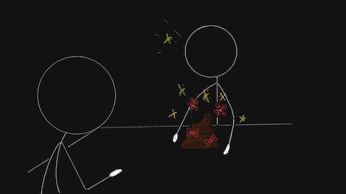

import Spoiler from "../../components/spoiler";
import AuthorCard from "../../components/authorCard";

In last week's [post](/blog/find-manager/) I talked about the questions to ask in interviews in order to get signal on the culture of a company. Those questions are pretty useless however if you don't know how to listen. 

Sometimes, it is not even the answers to our thoughtfully planned out questions that give us the most information, but the information they choose to volunteer. Because people tell on themselves a lot, if you listen. This happens in interviews, dates, or even long-standing relationships. 

That being said the truth is often presented in a distracting way. People often wrap it in excuses, fluff, phrasings, or even jokes to make it more palatable, or to suit their intent. They will wrap even the most horrible truths in the nicest wrapping, decorate it with a lot of razzle-dazzle, but it is essential to be able to still recognise it for what it still is, shit. The worse the truth, the more we want to believe the wrapping. Even when they tell us plainly, we want to choose the prettier version.

Listening is about being able to see past the razzle-dazzle. And thing is, the pretty truths, the good ones, they don't need the razzle-dazzle. But don't miss them because of it.

## Strategically polished truth

Strategically designed polished truth is what I call truth presented with the active intent to deceive and manipulate. Lies are actually fairly difficult to fabricate and keep consistent. They can be more easily disproven. However, it is much easier to both remember what has been said as well as keep control of the narrative if one uses the truth, just presented in a more favorable manner. We can take a look at the propaganda machine for the most classic example.

The reporting on the "war" in Israel has been a [treasure trove of how this truth is used](https://en.wikipedia.org/wiki/Media_coverage_of_the_Israeli–Palestinian_conflict?utm_source=chatgpt.com). The truth gets wrapped into a more palatable interpretation that makes, in this case, Israel look like not necessarily the bad guys.
* **"*People are starving in Gaza*"** - note the use of the passive voice, even when this is a starvation that is entirely engineered by Israel. There are more and more humanitarian missions that have been blocked out of Gaza, sometimes violently. The olive groves are being uprooted, the land is being stripped bare... yes people are starving, but unlike in the case of a natural disaster this is [entirely man made](https://www.theguardian.com/world/live/2025/aug/22/famine-benjamin-netanyahu-palestine-gaza-israel-war-latest-updates?utm_source=chatgpt.com). A more honest sentence would be "Israel is starving people in Gaza."
* **"*Bombs fell on Gaza overnight*"** - as if bombs decide to take a midnight walk and just happen to fall. No mention of who dropped them, no accountability. Contrast this with coverage when Israel is bombed: “Israeli childcare center bombed.” Suddenly there’s a clear subject, a target, and active voice, making the attack sound intentional and horrific, which it is, but so are the bombs dropped on Gaza. 
* **"*Clashes erupted between police and protesters*"** – a classic media line, not just in Israel/Palestine. Clashes don’t “erupt” like volcanoes. This phrasing hides responsibility, making state violence sound like a spontaneous natural disaster rather than the result of choices and power.

While I used examples from the media, that is not to say people don’t use these in day-to-day life. They do. All the time. It is generally more premeditated, that is, with the intent to deceive, but not necessarily in that it needs time to prepare. I think the biggest hint for this type of situation is the use of the passive voice (a classic way to avoid responsibility) and purposefully omitting details, like causes, actors. This has a level of maliciousness that is hard to prepare for.

It can come up in a work context. Like calling out you asked other people for advice publicly, discrediting the team, even when they were the ones who asked you to do it in the first place, but that is not mentioned. Or in dating. Like talking about the “crazy ex-girlfriend,” where the perspective is framed so that it sounds like they were powerless. It’s a choice in framing.

And before I call everyone who does this evil, it’s not necessarily the case. It’s more a matter of self-awareness, or lack thereof. Our brains are ultimately egocentric, and left to their own devices they will store memories in a way that makes us look good. Not factually incorrect, just better than they actually are. 

## Sequin Covered Truth

Here the truth is delivered with so much pizzazz we sometimes fail to listen to it. It’s usually wrapped in a way so pretty that it appeals to the listener’s ego. So, instead of hearing the raw message, we get distracted by the *shiny*. But listen closely, because beneath the sequins, the truth is still there. 

* In Dating: **"*You're too good for me*"**. On the surface it feels like a compliment. It strokes the ego, makes you feel special, maybe even noble. Delivered with a pout, it might even trigger your inner people pleaser: “No, babe, you’re amazing!” But strip away the sequins, and the truth is simple. You are too good for them. They know it, and you should know it too. It's not "You are so good, I want to try and be better to deserve you.", that shows that they are trying to be better for you. But "You are too good for me." It's a full stop. A finite statement. Run.
* In a Job Interview: I (now) always ask how many women there are in the team, or at the company, after I got an offer. The answer that makes me want to run? **"*There are just not that many qualified women (like you).*"** It sounds flattering, even admiring. They’ve been searching high and low, to no avail, but only **you** made the cut. Alas! What they’re really saying is: the way we define ‘qualified’ likely excludes women, because our requirements are designed for men.

Sequin covered truth works because it’s flattering. It appeals to something we want to believe. But if you ignore the glitter and listen to the words themselves, the truth is rarely something you should stick around for.

## Truth, with a Chance of Gaslighting

This is truth that comes dressed up as a joke, or disguised as banter. Someone says something sharp, maybe even cruel, and either they tack on a laugh at the end or, if you react, suddenly it becomes “just a joke.” If it was really a joke, it would have been funny the first time around. Instead, the humor only appears when accountability is on the line.

My ex was such an expert at this he could probably have written the manual, so I need look no further to provide you with examples of what I mean:
* **"*If I had to choose between you and jazzband, jazzband will always come first.*"** Said straight, said seriously. I don’t even need to translate it. When I finally shared how much it hurt me, the response came back: *“I didn’t think you’d take it so seriously, it was a joke. Geez...”*
* **"*You should become a professional dominatrix.*"** The first time, maybe darkly funny. The third or fourth time, the truth shows through: this isn’t banter. This is how he already saw me, both as the role I fulfilled and my potential, and he wanted me to see myself the same way.
* **"*My mother said to bring you flowers, how funny is that! Wouldn't it be ridiculous to need flowers on Valentine's Day?*"** I laughed along, and even nodded([please don't ask why... I regret it enough already](/blog/just-because-i-can/)). Because I indeed didn't need flowers, doesn't mean I didn't want them. The truth? It's right there. He found the idea ridiculous, and he was never going to do it. And he didn't. For 5 years. I "forced" him to do it in the 6th. 

It comes up elsewhere too. Like at work. Here it's the easiest to not laugh and have them explain the joke, so you can laugh too... then laugh at how they stumble, because they know they were inappropriate. Or they were being immature and passive aggressively complaining about something, like:
* **"*Ah, the most likely to miss the site going down is X because he's out for a smoke.*"** I used this one. Not my proudest moment. We did try and have a mature conversation about his smoking though which lead nowhere... so, what was left was passive-aggressive humour. Oh, how I hated the smell of his vapes. Still do. 

You know the phrase "it's funny because it's true"? Well, this is essentially why almost always jokes hold some truth in them. So, listen to what is being said, because what they may see as a joke... may not really be a joke.

## The Truth that is, but for a Very Good Reason™

This truth is delivered with such finality, we just accept it as fact. It often comes with a reasoning that seems legit on the surface but fails under scrutiny. Because sometimes it does appeal to the emotional side. The excuse becomes the focus, so we fail to see the truth underneath.
* At work: **"It will never work because of X"** - is a tricky one, as it depends on X. If X is obvious to you, it may be obvious to them, that doesn't mean their first statement wasn't true. Try to disprove X, briefly, but pay attention to how they respond. Is there resistance? If so, it [might not be about X](/blog/worst-advice/). Can't blame them for not telling the truth. It will likely never work, because they don't want it to.
* In a relationship: **"*My ex was always forcing me to tell her I loved her, so now I can't say it because it feels like a lie.*"** The reason tugs at your empathy. Poor them, with their difficult ex... But listen again. Drop the excuse and you still have the fact right there, “*I can’t say it because it feels like a lie.*” That’s not about the ex, that’s about you. In this relationship. In this moment. They’re telling you that saying “*I love you*” would be dishonest. That’s the truth, no matter how touching the explanation sounds.
* At a consultancy: **"*In a consultancy the product we sell is your time. You are hours we sell.*"** On the surface, factual. Even logical. But what does that mean for you? That you are not a person to them, you are billable hours. A day later, their government-mandated pay-band report revealed just how much they underpaid me compared to their declared brackets. The dots connect themselves. The truth was already spoken, politely disguised as business reality.

This type of truth is dangerous because it sounds reasonable, even sympathetic. The explanation can be illogical or irrelevant, but once it’s attached, we let it soften the blow. Don’t get distracted by the story. Listen to what they are really saying. The explanation is just there to warn you against complaining about it.

## Spot the Truth

To finish off, let's play a game. I will give you a list of statements you can think of what they are saying, and what would be a more honest way to say it and interpret them. While this lacks a lot of context to help you spot what is really going on, try to think if this person is saying something positive or negative for you.

* <Spoiler title="Friend: I’m not really emotionally available right now, but I don’t want to lose you as a friend."><>
I am not emotionally available right now. I will not put any emotional effort into our relationship. You are good as a friend. Potentially: I like how emotionally available you are, so please keep being there for me, while I give you nothing in return.
</></Spoiler>
* <Spoiler title="Colleague: Careful with X today, it's that time of the month."><>
Haha, not funny. Translation: X's emotions and objections aren't valid, she's just "hormonal". P.S.: I do not see women as Equals.
</></Spoiler>
* <Spoiler title="Date: I was in a really bad relationship in the past, and I need to take things a bit slower so my body knows it can trust you. Is that ok?"><>
The excuse is fluff, they don't need to add it, but they are asking you to take it slow. It is up to you to decide if the pace is something that works for you.
</></Spoiler>
* <Spoiler title="Boyfriend: I don't deserve you."><>
Yeah, you're too good to him, and he's not doing anything in return and not planning to. Run.
</></Spoiler>
* <Spoiler title="Situationship: I am really comfortable with you. We don't need labels like love right? And who even knows what love is?"><>
They are very comfortable with you. You're probably making it very comfortable for them. They don't want to change that or commit more than that. P.S." They don't love you.
</></Spoiler>
* <Spoiler title="Colleague: A horse walks into a bar, and a bartender asks it, 'Hey, why the long face?'"><>
It's a joke. A bad one... and questionably funny, but a joke. Sometimes there is no hidden meaning.
</></Spoiler>
* <Spoiler title="Date: I just got out of a relationship, so I’m not ready for anything serious right now."><>
I am not ready or interested in anything serious right now. With you. The tell? Being ready is something you prepare to be, doesn't just happen, if you wanted to, you would become ready.
</></Spoiler>
* <Spoiler title="Hiring manager: We'll keep you in mind for future opportunities."><>
This one depends. Sometimes it’s a polite no, and you’ll never hear from them again. Sometimes they really do reach out a year or two later. If you’re in a really pessimistic mood about how the interview went, you could hear it as “we’ll keep you in mind, so we can reject you faster.” But this one does no harm to take as truth until proven wrong.
</></Spoiler>
* <Spoiler title="Date: You're lovely, but why do you have to dress so flashy?"><>
They don't like the way you dress. Also called the compliment sandwich where they tell you how they feel and add in a compliment, often one they don't mean. I wanted to write a work example here, but that was too much for me.
</></Spoiler>
* <Spoiler title="Friend: I am on holiday right now, I will message you when I get back, it's just so busy."><>
They are busy on their holiday, and don't have time to message you. Do they message you when they get back? Great. You may be the kind of friends who don't share holiday stuff.
</></Spoiler>
* <Spoiler title="Friend: I will really miss you."><>
No fluff needed. They will really miss you.
</></Spoiler>

<AuthorCard />
