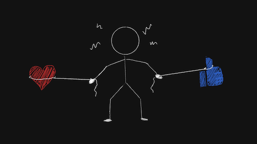

import Footnote from "../../components/footnote";
import AuthorCard from "../../components/authorCard";

In an age where cases like [Gisele Pelicot](https://www.aljazeera.com/news/2025/7/13/feminist-icon-gisele-pelicot-awarded-frances-top-civic-honour-report)'s become more visible, and I say visible and not more commonplace because I refuse to believe this is a new phenomenon, I have seen more and more women wondering "_Do men even like us?_". How can men claim to love women, when social media is exposing how a lot, if not most, of them do not even like us? 

I think it's to be expected. It's how most of us are socialised from the moment we are born. In her essay "[Justice: Childhood Love Lessons](https://www.goodreads.com/book/show/218042.All_About_Love)" bell hooks talks about the epidemic of lovelessness, abuse and neglect children grow up in. While she focuses on the US, I do not believe for a second it is limited to any location. As children, we are wired to love our parents and our families. But even as children how can we like someone who abuses us? Someone who mocks or dismisses our most natural and true selves? We adapt. We learn to disassociate love from like.

In that same essay, bell hooks talks about how love and abuse cannot coexist. That is to say one cannot love someone and abuse them at the same time. While I agree, that doesn't say anything about the victim, in this case, the child. A child cannot abuse a parent, regardless what that parent may say in order to justify their behaviour. Children love, but they learn to separate that from like. And then turn that dislike inwards, as well as outwards, depending on temperament. 

## But my parents love and like me: An exercise

Whether you agree with bell hooks's statement that love and abuse cannot coexist, or may still try to put down the abuse to ignorance, while perpetuating messages that you may have received throughout your childhood like "_Tough love is the only way they will learn_", "_I have to hit you, so you learn discipline_", "_I am doing this for your own good_", that is up to you. There is plenty research and literature on child developmental psychology out there for you to peruse whenever you are ready to. As children, we long to be loved by our parents, and I don't think that ever changes as adults. So, we believe the things we need to believe in order to fulfil that basic need for love. Even if that love is imagined.

Meanwhile, if you are curious and want to challenge it, here's a risky exercise you could try. Ask your mother or father: "_If they found out that you were accidentally swapped at birth in the hospital, would they still love you?_" A decent parent will immediately say "_Of course, darling_" or some variation thereof depending on their personality. End of story. First red flag should however be if the response is "_There's no way that could have happened._" or "_Don't be ridiculous_". That's your answer right there, it's a **no**. I do not advise prodding further on the hypothetical after that. The "_No_" will hurt, but the elaboration that may come after the **no**, will likely hurt a lot worse. If the answer is no, can it possibly be love? It's nothing more than duty, at best.

## A default of dislike

It's crazy to me how many parents complain about their children. Children they **chose** to have. And I am not talking about them complaining that they are tired as their baby kept them awake all night because of teething problems. Parents can complain about their troubles, as humans we do this in order to relieve stress. But that is not a complaint about the child. It's not making the child seem like they are torturing their parents (on purpose) by choosing to have a cold before they have an important meeting at work, thus sabotaging their parent's chances for a promotion. Yet, somehow that is not unheard of. The father complaining at work that he'll have to babysit the children<Footnote presentation="0">His own children, mind you. I have learnt to distance myself from people who do this at work. I find, they do not deal well with taking responsibility for their actions in general.</Footnote>, the parent praising their friend's child while putting down their own, the parent complaining straight to their child as to why can't they be more something else... These are all so common. Is it because we can't see the issue with it? 

Yet, we are all surprised when those same children grow up to be adults who complain at work about the "old ball and chain", or spend hours complaining with their friends about their husbands, while making no attempts to leave, nor fix the marriage? There is no surprise. Because a husband complaining about his wife is seen as more normal than the same husband choosing to only express the love for his wife. We live in a society where the Addams Family are the weird ones.

These people still tell their spouses they love them. And by the definitions of love we are taught growing up, that may just be true. That's because the love we are shown growing up is paired with dislike. So, we have no issue allowing the two to coexist. 

## Love and abuse

Ever wonder why so many people choose to stay in abusive relationships? Don't even get me started on why we would rather ask "_Why did you stay?_" than "_Why did you abuse them?_". The reason I have seen is a conviction that there exists love in the relationship. And can love not conquer all? Maybe if we **just** get a little better, the abuse will stop. After all, there are good days. It's only if we've done something bad that their behaviour becomes cold, neglectful, dismissive, abusive... Sound familiar? It's the same discourse parents feed their children as they hurt them. And as children, being more "narcissistic" we are more likely to see the abuse as something caused by us, thus our fault. Any wonder why people with abusive parents are [3 to 6 times more likely](https://www.ucl.ac.uk/news/2025/jan/risk-domestic-abuse-increases-over-time-those-exposed-childhood-maltreatment) to end up in abusive relationships?

The dynamic is learned. And the study I linked? It refers to domestic violence. What about emotional abuse? Where the [abusive partner can control and abuse](/blog/gaslighting/) without ever raising a hand? Do we count that? It's even easier to go "_It's not abuse, they never hit me._" as an excuse to stay. Deep down however, we know we don't like them. But we still love them. Because we are taught early on that those things can coexist. 

## Do I like them?

Love can blind us sometimes to the fact that we do not like a person. So, let me ask you the classic question to ask yourself in such a situation: "_If someone told you that you were exactly like your parent/partner/friend, would you be flattered or offended?_". If you like them as well as love them, I have a feeling it might just be the best compliment you've ever received. 

Family is the hardest to ask that question of. They are connected to us from the moment we are born. We are told we love them, and I think we truly do. And isn't love just a more powerful form of like? Well... Think about this question: "_If you were to meet your parent as a stranger at a party would you want to befriend them? Would you avoid them?_"

As any child who's made the difficult decision to go no-contact with their parents can tell you: it is possible to love someone, yet not want them in your life. In fact, that may just be the only way you can sometimes love somebody. You can wish that they are happy, and at the same time you are allowed to not make that happen at the expense of your own happiness and safety. That is not hating them, that is loving yourself. 

## What is love?

There are a lot of one-liners I have seen all over the place which tell us what love isn't<Footnote presentation="1">Which is about as useful as asking a waiter what is the house special and them responding "_Well it's not a hamburger_".</Footnote>. There are even some attempts to express what love is, only for just as many people to jump in and try and show how it's not love but some pathology. A lot of the advice on how to love can be designed to make us feel even more ashamed of who we are. Thus, making it even harder for us to find love. 

#### Can you have love if you have dependency?
A lot of texts will claim that this cannot be. But children are fully dependent on their parents, for around the first 16 years of their life. Does that mean a child can never love their parent?

I have seen a lot of talks vilifying codependency as a fault in the dependent partner. But codependency is not an issue of depending on your partner. But an issue with the abandonment of the self. Dependency in itself is not a bad thing, it's how we humans have evolved -- to be dependent on each other. But any sign of dependency nowadays, and we are called co-dependent. It has almost become another stick in the repertoire of those who want to shame their partners for having any needs. 

#### Can you love someone who abuses you?

While I agree with bell hooks's statement that you cannot love someone you abuse... What about the reverse statement? While there is no doubt that attachment will form in the case of abuse, thanks to intermittent reinforcement (also known as trauma bonding or the "slot machine" experience), can the victim of abuse feel love towards their abuser?

I personally believe it can be love. To use Dr Ramani Durvasula's analogy, you can love a house even if it has a hole in the roof. It's a beautiful house after all, we can love things in spite of their faults. The challenge is acknowledging that it is not possible to live in that house, despite loving it... on a sunny day. If we choose to pretend there is no hole in the house, then this is probably not seeing the house for what it is, and likely it cannot be love. Yes, roofs can sometimes be fixed. But with people, unlike with houses, the house needs to want to fix their own proverbial roof. We can help them along the way should they choose. But if we only love them if they fix their roof, then that again is not love. Still, we can love the house, and choose not to live in it.

#### Can you love someone else if you don't love yourself?

It's hard, but I think it's possible. I don't think it's hard because we are incapable of love, but because, if we're not self-aware enough, we may default to behaviours we were told were love, which were anything but. We may have grown up to see criticism and trying to fix someone as love, but it isn't. If we cannot see that, then we cannot love. 

That being said, you can be ready to love even if you haven't learned how to do it for yourself quite yet. Claiming that we should not get into relationships until we've fully healed and learned how to fully love ourselves, may prevent us from doing that exact healing we need. And what is **fully** healed anyway? Just like it's easier to be kind to a friend, it's easier to love someone else sometimes. Because the things that are sometimes preventing us from loving ourselves are the scripts that have been fed to us by our parents or past partners. We are perfectly capable of loving others, yet we still have that voice returning whenever we're not paying attention. 

But we can love, and if they love us back, they can, if we let them, show us how to love ourselves in return. If we listen, they will teach us to look at ourselves through loving eyes, something we may never have had the chance to experience. We all have blind spots, the trick is to help each other. I think lovelessness, especially in its extreme, is trauma. I agree with the [Gottman approach](https://www.gottman.com/blog/couples-and-shared-trauma-healing-together/) that we don't need to heal all of our traumas alone. In fact, I don't believe we can, because alone, a lot of our traumas would never get triggered in the first place. We can absolutely love someone else, even if we don't fully love ourselves. Of course, someone else's love will not magically heal all our wounds. We still need to do the work ourselves. But it sure will give us a guiding hand. 

#### Can I just love a part of someone?

I don't think so. Not really, at least. I think that's why some people avoid asking questions about people they desire. It's why people romanticise mystery in relationships. We like certain parts of that person, so we put conditions on love. It may not look like "_I love you if_", but "_I love you when_". Sure, we may think we love that person, but what we love is a fictional version of them. A projection. A lie. We avoid learning about them because it may go against the fictional projection we have created of them. Yes, we love the fiction. But we don't love the person. Loving someone is wanting to know them. Fully. And that in itself is a lifelong quest.

This is one of the reasons I think abuse in early childhood is so dangerous. We learn to associate the abuse with love. And we do love our parents, we are biologically wired for it. So, we disassociate, and we tell ourselves whatever we need to in order to survive. Like "_we deserved it_", "_it was good for me_", "_if only I tried harder, they wouldn't have to punish me so_"... So the children learn to love the abuse too. Love is a whole experience, it cannot be done in parts. None of them will claim to like the abuse. But it will not diminish their love. So when these same children end up in abusive relationships in adulthood, is it any surprise it does not diminish their love for their partner?

#### Can you love someone who doesn't love you back?

Technically, yes. But question how much you know about the person. Do you love them, or a fantasy? It's perfectly ok to love the fantasy. Just be aware you don't love the person (yet). Loving a fantasy can be a source of joy, it's how K-pop groups have been monetised and become so successful. But if you only love a part of that person, what you can see, what they choose to show you, that does not last, because it's not loving the other person. But we can fully know a person, love them, and have them not love us back. Like an abused child can love someone who doesn't love them, i.e. the abusing parent, we don't need someone to love us in order to love them. Love does not demand anything in return. The question is, how do we let that love inform our actions?

## A path forward to love

You know the phrase parents often use in order to keep you in their lives "_Blood is thicker than water_"? It tries to teach us to love even when we dislike. It's pervasive in today's society, unfortunately. But we can choose differently. We can choose to only keep the love that also likes. The love that loves back.

Funny thing is? The full quote is "_Blood of the covenant is thicker than the water of the womb_". The exact opposite message. Found family, in friends, partners, and the community we build can offer us the love we have always wished for. These are all people who chose us, should we allow ourselves to be chosen. Their love is not one born out of duty, but by choice. It's why my favourite portrayal of parents in a movie is Stanley Tucci and Patricia Clarkson in [Easy A](https://en.wikipedia.org/wiki/Easy_A). Even when we are single, we can seek love in friendships. It will not be romantic love, but that will not make it any less true. After all, we do not feel romantic love towards our parents either. So, just because our parents didn't love us, doesn't mean all hope is lost. It just means we need to be more intentional in how we learn to love. And with intentionality, even though we started off at a disadvantage, we can learn to love even more fully and more powerfully, because we know what it means to not experience love. With intentionality, we can choose to only keep the love we also like in our lives. To do that however, we may need to question everything we have been taught throughout our development. 

<AuthorCard />

--------
0 His own children, mind you. I have learnt to distance myself from people who do this at work. I find, they do not deal well with taking responsibility for their actions in general.

1 Which is about as useful as asking a waiter what is the house special and them responding "_Well it's not a hamburger_".