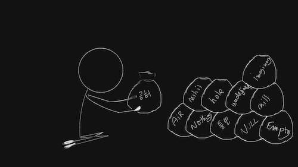

import Footnote from "../../components/footnote";
import AuthorCard from "../../components/authorCard";

What is constructive nihilism? This post comes as a response to the following paragraph from The Art of Loving by Erich Fromm.

"_This courage is very different from the courage of which that famous braggart Mussolini spoke when he used the slogan "to live dangerously." His kind of courage is the courage of nihilism. It is rooted in a destructive attitude towards life, in the willingness to throw away life because one is incapable of loving it. The courage of despair is the opposite of the courage of love, just as the faith in power is the opposite of the faith in life._"

I agree that the nihilism he describes is indeed destructive. And, while he describes this as a different type of courage, technically, he also looks down on it. Because, as he compares with the faith in power (vs the faith in love), the faith in power is not real faith. 

I have previously posted about how I didn't use courage to make the [decisions](/blog/decisions/) I have made, because ultimately they came from a place of [nihilism](/blog/eat-pray-love/). So, I do not think nihilism is necessarily destructive. While I agree, and it can be, it can also be constructive. Properly deployed, when one lacks [faith](/blog/faith), nihilism can be incredibly constructive.

## The Constructive Nihilism Mindset

At the core of nihilism is the belief that things have no meaning. That things don't eventually work out. I also have seen a hint of stoicism within nihilism in not relying on things one is not in full control of. Which as you can easily imagine can be taken to extremes. 

Constructive nihilism, is letting that belief exist: that things have no meaning, that things will not work out anyway, that there is not really anything out there for me... And yet moving forward. Building something out of a lot of nothing. 

I don't think it's a hard concept to grasp. We did it as children. At least some of us did. It's the feeling behind building sandcastles out of sand on the beach, knowing that the wave will come and tear it down, sometimes before we even got the chance to finish it. It's building it because I can, because I want to, and because it's fun, or even pretty<Footnote presentation="0">And not doing it for the Instagram. Back when I was a child cameras were rare, film was expensive, and there certainly was no Instagram.</Footnote>... But the wave will come, and it will tear it down. Maybe if I get lucky, it will be there long enough for me to finish and enjoy looking at it for a while... or maybe not. I may be disappointed, but not for long, because I saw it happen before, I knew the wave would come, I expected it... and I built it anyway.

## Principles of Constructive Nihilism

I shall attempt to describe a few principles I hold that I describe as _Constructive Nihilism_. It may not be a comprehensive list, and as time passes, I may change my views. But in a time with little faith in life and humanity, I think these ideas have helped me move forward, and whether they form a philosophy or not, they were still helpful. And certain ideas can be helpful at some times but not other.

With each of them I will also give an example as to how that same idea can be taken too far, and devolve into something destructive. It is commonly seen as nihilism inevitably leads to passivity, despair, apathy, or addiction(hedonism), and it can, but this is about the constructive side of it. Even if the counterexamples are exaggerated, that thinking is still what seeps in at times, albeit more subtly...

### Nihilism and Authenticity

**Constructive nihilism**: People will see me as a villain regardless of what I do if it suits them, might as well do what is right by me. 

**Destructive nihilism**: People will see me as a villain regardless of what I do if it suits them, so might as well be a villain and do everything only for myself.

Constructive nihilism is accepting that despite my best intentions, I may still be seen as a villain. It's a good antidote to people pleasing. And in that environment, I choose to behave authentically to me. If that means seeming selfish at times, so be it, but I operate on my set of values. Not because I think they are superior, or they would have any returns, but because they are true to me. I don't need a deity to promise heaven or hell based on how I adhere to them. And I don't need them to adhere word by word to that which others expect of me, be it explicitly or implicitly. It's not permission to commit crimes, it's permission to live as who I am.

### Nihilism and Motivation

**Constructive nihilism**: If everything will fail anyway, might as well do what’s interesting to me. If I will always be miserable, might as well be miserable somewhere nicer.

**Destructive nihilism**: If everything will fail anyway, what's the point in doing it? I will be miserable regardless what happens, I'll just choose the easiest way.

Change usually requires a lot of courage. Courage and faith that things will work out, or that there will be someone to catch us when we fall. That is not something I can often muster<Footnote presentation="1">*cluck cluck cluck*.🐔</Footnote>. Would I like to? Sure, absolutely! But it's not like I can order a pint of courage at the bar<Footnote presentation="2">Well, technically, yes, I could, and people do... I don't drink anymore... and I am saying that as if it's the biggest flaw in that idea...</Footnote>. Courage is for the faithful, and for the rest of us, we try to build small safety nets, and then we either get stuck... or choose to leap regardless.

To me constructive nihilism is taking a leap assuming I would fail, but jumping anyway. If I was a fan of skydiving I would probably compare it to that. You jump to enjoy the flight, but you expect you will eventually hit the ground, you're not expecting you're going to suddenly turn into a bird or gain the ability to fly. Normal people think of the parachute and how safe it really is. But I am not normal, and to me it sounds absolutely and unnecessarily frightening. What if the parachute fails, and we crash, just because of a little fun?... Actually, maybe it's a good analogy... The only difference being that I will never try skydiving, but I do find myself skydiving in life. And like with skydiving, I assume, once I did it, I always find that it was a lot safer, and less scary after I've done it. 

For a calmer, less anxiety inducing comparison: It's building the sandcastle knowing it will be gone tomorrow just because I am on the beach, or going to the beach just to play in the sand with the same knowledge. It's doing things against the advice of others and the statistics... Not because I believe I will be in the 1% or 0.1% who succeed, but because I want to do it. Because I don't want to regret not trying. 

I do it for the act in itself and not the result. If I were to do it for the result, I would get demoralised quick and get stuck being unable to do anything, I know because I used to operate that way.

### Nihilism and Relationships

**Constructive nihilism**: Nobody will like me anyway, might as well work towards liking myself.

**Destructive nihilism**: Nobody will like me anyway, people suck. I will isolate myself. Nobody is worth my attention anyway. If I can use them fine.

I think nihilism has been a way for me to relate to myself. While I do believe it is ultimately impossible to please everyone, as well as adapt myself to please the people I want to please or attract... I can't deny the impulse. But there's nothing I can do to make someone like me. I can't make the person I am attracted to be attracted to me... That is up to them. I could worry about being the type of person they like, but instead if I just accept that I won't be, I can focus on being someone I am attracted to. If I want to be very muscular, I will be muscular because **I** like muscles. I will like the things I like even if they are "cringe". I will enthuse about them, because it makes **me** happy. 

Do I think I am too much? Maybe... Ask 13 year old me, and she would have never believed I would be able to openly like K-pop... I didn't make these changes because I thought people would like me more. I did them in spite of thinking people will not like me for them. And crazy thing is... I have actually had a much easier time making friends now. Yes, I lost quite a few in the process too... And I may lose others in the future... But the people who like me now, like me for who I am now.

### Nihilism and Happiness

**Constructive nihilism**: Life has no meaning, so might as well just find the small happinesses.

**Destructive nihilism**: Life has no meaning, so might as well milk all the enjoyment I can out of it at any cost.

If life has no meaning, that which can make us truly happy in seeking... maybe I can stop seeking a great happiness. If there is no great meaningful career, or calling in life, if there is no ikigai, the pressure to find it releases. And then I can focus on the small things that make me happy. Like my daily gym trip, the odd theatre show, or just a really well-timed bagel. And if we can, do it in a way in which we can prolong how long we get to experiences. Because those small happinesses may just be worth collecting in the annals of our memories, even if they disappear with us.

## Finding Courage in Nihilism

While I do agree with Fromm that there isn't really any real courage in nihilism, I think nihilism allows for a certain type of fake courage that can help people move forward. I can most easily summarise it as have the fear of doing nothing be greater than that of doing anything. It's not always feasible, and I am still, and will always be quite risk-averse as an individual. But it's something that can spring us into action when there is no courage, while also not disregarding the world around us, like the example Fromm gives of the "live life dangerously" philosophy. 

It's building the sandcastle even if it's going to disappear, because I am on the beach anyway. Because it's pretty, because it will make me happy, because sometimes it's just something to do. 

<AuthorCard />

--------
0 And not doing it for the Instagram. Back when I was a child cameras were rare, film was expensive, and there certainly was no Instagram.

1 *cluck cluck cluck*.🐔

2 Well, technically, yes, I could, and people do... I don't drink anymore... and I am saying that as if it's the biggest flaw in that idea...