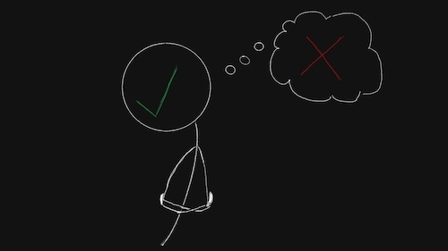

import AuthorCard from "../../components/authorCard";

As people pleasers, we have developed to be quite attuned to people's emotions, in order to please them. We are especially able to distinguish someone's negative emotions, and their shifts in mood. However, what I have found, was that while I was really good at reading people, I doubted myself a lot, because I rated myself on the ability to read their mind not their emotions. Because when I was really reacting to their emotions, and not to my interpretation, I was doing it too fast to realise I was doing it.

I don't think I need to tell anyone how disadvantageous that is in a relationship. And how easily we can be taken advantage of and grow resentful. This is not something we want. These are all instincts of the fawn response. And we can react faster than we realise we are. That doesn't mean the skill isn't there, just that we don't use it wisely. 

I think there is a way to hone this skill and use it productively. The more we are aware of it, and trust our intuition, we can also release its hold onto our behaviours. I want to share what has helped me. And while I still get caught out in my people pleaser ways occasionally, that has been a lot rarer. That is if you don't count my people pleaser thought spirals, but at least I can contain them before I do any damage.

## You Can Read Emotions, but You Cannot Read Minds

I think the biggest impediment to reading people is jumping to conclusions. I see this in myself a lot. As soon as I read a shift in emotions, my brain immediately jumps with a conclusion about what the other person must be thinking. Here's a hypothetical you may have encountered. There is someone you meet often. They are always warm and pleasant towards you. Then, suddenly, one day, they act cold towards you or even grumpy. Your brain might immediately go "_Did I do something wrong?_", I know mine does. This is a hastily drawn conclusion by the inner critic and the protective fawn response. However, a million things could actually be going on. Like, they may have walked into a puddle on their way to work, they may have broken up with their partner, they may have gotten scammed... the list goes on. 

Thinking of all of these things can be helpful holding back on acting. A first step for me was making a rule for myself that unless someone tells me, directly, that I did something that bothered them, I won't apologise, or try and fix it. I may worry, but just a little. That rule has saved me from a lot of unnecessary people pleasing over the last year. But I see this as a preventative measure. A way to stop the people pleasing. But how do we turn it in something productive? 

What I found most helpful is forcing myself to go back to "_What do I actually know?_". I will be able to disconnect my conclusion from the observation. They're not being cold towards me, but they are being distant in general. They seem like they are having a bad time. If I think back, I may even recall that over the last couple of days they seemed a bit distracted and were bumping into things. Ultimately, this person was having a bad day. Sure enough, in a few days we were back to our old way of interacting.

If you think about it, you might find there are specific feelings or thoughts that always appear when your people pleaser is activated. For me, it's "_Did I do something wrong?_", or a restless feeling accompanied by "_I want to make this better._". When you hear those, it's the most important time to take a step back and center yourself. And if appropriate, maybe just ask them what is going on.

## Centering Yourself

When my people pleaser acts up it can sometimes send me in a social anxiety spiral. Say someone said something and I read concern. The thing about concern is, while I can read that it as concern, it's not obvious whom it's directed to. So I spiral. It's not nice, but I have learned to stay with it. I may let that spiral out with friends, or even ChatGPT in a pinch. It will take a little while to pass, and until then, I won't do anything I can't take back. Once I am back on fully rational soil, then I can start analysing what actually happened. People pleasing can give a negative perspective even to positive things sometimes. After all it's best to assume the worst, right? So, it's best to clarify things when you have calmed down. It can sometimes be as simple as a message to check if you got things right. You may find they were concerned for you and not about you. 

That being said... There are times when it's important to act and deal with the consequences later. Those are situations when you feel like the fear is urging you to act. Do it. If it's the fawn response talking, sometimes it is actually a survival situation, and fawning may just be the correct adaptive response to get you out safely. Learn to identify how you react. For me, when I feel really in danger it's not the fawn response that gets triggered, which as a people pleaser is my default, but my fight or flight. Listen to it, your brain picked up on something that the storyteller in your head hasn't had time to rationalise yet. And so what if you got it wrong? Best case, you were wrong, and you seemed a bit rude... Worst case, you end up dead... or worse...

## Preparing Yourself

If you are planning on using this skill intentionally, there are easier ways to tune into your intuition, because you don't have to regulate first. So if you know a situation will require you to get as much information on a person as possible, like an interview, or an early date, remember you have a superpower in your hands.

Before going into the situation take a minute to list all your feelings. Maybe you are feeling restless already because of some external reason. Maybe you are feeling particularly happy. Then, when you go into the meeting, any change in your mood is one of the most powerful signals to use. Irvin Yalom refers to it as looking at the here and now in psychotherapy. For example, if he is bored with a client, what does that tell him. If you felt calm going in, and suddenly you are all antsy, maybe the other person is doing something that is putting you on edge, even if you can't put your finger on what it is. 

Positive signals also exist. If you were feeling edgy, and you walk into a room and suddenly feel safe and calm, that is a signal. I chose my gym that way and have not regretted it for a second. I was genuinely nervous, I don't like new places, and I admit I was worried about being judged. The plan was to check out a few gyms and choose the most reasonable one. But I walked into my gym first and instantly felt calm. I only checked that it had all the equipment I needed, and I signed up for the gym and PT sessions right away (these weren't even the plan, and they didn't even try to sell me on that). I probably got a bit of judgment for that. While I never confirmed it with my PT, I was probably the easiest sell. I have been going there for over 8 months now and have absolutely no regrets. 

## Acting on the Information

As a people pleaser, especially one with a bias for action, my reaction is to act. If I can't act, I get uncomfortable really fast. However, those actions are not always thought out to be in my or the other person's best interest. Because I am not acting to make things better, but to release the anxiety. 

First thing I need to ask myself is whether I want to act on the information I have. Often, the best course of action is to notice it, then let it be. So if someone makes a passive-aggressive comment towards me or seems upset. Let it be. If it indeed is a problem with me, trust the other person is an adult, and they will mention it. Now they may not be mature enough to do so, but that isn't my responsibility. Otherwise, make a mental note of it and let it be. This was something that was very useful in interviews. Someone was constantly interrupting me and correcting me, even telling me the question I asked was wrong. I could have gotten upset. But I didn't. I let them continue, and wrote it in my interview feedback. Was it because I was a woman that he kept interrupting me? Or did he know he couldn't answer the question I asked, that he purposefully directed it to a similar one he thought knew? Does it matter? 

Now, if it's a relationship in which you care about the other person and do want to be of help if you can be, that is ok. Just make sure it's because you care for them. Then it's even more important not to make any assumptions. If your relationship allows, just ask them if they're ok and what's troubling them. Or bring them a coffee and say something like "_I've noticed you seem to have been a little down lately, I am here if you want to talk about it._" if direct confrontation is less your vibe. Then let them take it from there. They may not want your help or presence, that is ok. It's not a rejection. They may not need it. 

Speaking from my experience, sometimes just the gesture and presence means more than anything. Anything more can risk being too much. And even if your inner critic is saying you need to fix it now... it's likely wrong. It's often not your responsibility. The people you actually want in your life won't make it your responsibility. 

## Further Reading

If you are interested in this topic and the research on this I think there are 3 books I would recommend most of all. I have talked about them before.
1. [The Gift of Fear](https://www.goodreads.com/book/show/56465.The_Gift_of_Fear) by Gavin de Becker
2. [The Power of Body Language](https://www.goodreads.com/book/show/6943407-the-power-of-body-language) by Joe Navarro
3. [Emotions Revealed](https://www.goodreads.com/book/show/167380.Emotions_Revealed) by Paul Ekman

One important takeaway for me from the Ekman book was that I rely more on people's voice than their faces to read emotions, or even their way of walking. I can even recognise individuals from afar by the way they walk. People can fake a happy or sad emotion, in fact most of the photos in that book are fake, but as Ekman points out himself, they can't fake a happy voice as easily. Even though there are sounds that are universally associated with each core emotion.

There are so many other signals that we can catch on, that can't just as easily be taught in a book. That is why the de Becker book is in there, because if there is a book that teaches you to trust your intuition it's that one. And your intuition may be picking up not only on the other person's emotions, but their actions as well.

## The Super Power

In my experience, the two essential elements to turning people pleasing into a superpower are:
*  Accepting that we can be very accurate in identifying someone's emotions, especially the negative ones, but that doesn't mean we can read their minds. We will always miss context.
* Disabling the instinct that tells the people pleaser in our head that just because something is wrong, it's our responsibility to make it better. If the people pleasing comes from parentification, it is something so ingrained you may not even realise you are doing it. And it may even be praised as being able to take responsibility. 

Just because we are aware of somebody's emotions doesn't mean we are responsible for them.

<AuthorCard />