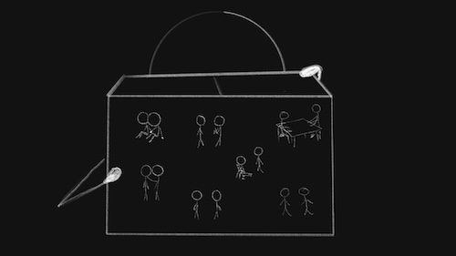

import AuthorCard from "../../components/authorCard";

Don’t know how many of you have been following my [gym crush](/blog/gym_crush/) thread, a series that started with this post, and inspired many others([2](/blog/gym-like/), [3](/blog/marry-pretty/), [4](/blog/burden/), [5](/blog/heal/)), but I would like to inform you that nothing has changed since January. 

Well, my feelings have evolved, but the situation has not. You may ask “_Why haven’t you said anything by now?_“ or, like my friend, kindly but with a great deal of exasperation may sigh “Just talk to him already…“. Trust me, I have asked myself those things hundreds of times by now. Yet, every time it comes to it, I chicken out. 🐔🐔

Maybe it’s the [video](https://www.instagram.com/reel/DQRZEUTiQ-U/) of a fellow immigrant to Korea talking about the flirting culture in Korea, or more specifically the lack thereof, that triggered this line of questioning again. Ultimately, it just highlighted something I already knew. If I don’t do something about this, nothing will change. So, why don’t I?

## The Beauty Of Not Knowing

You know the saying “_the cat is alive and dead_“? The idea basically is that while you don’t know, all possibilities exist at the same time. Both rejection and acceptance exist at the same time. There are so many different ways in which he could respond with interest, all so delicious to imagine. None of them beat a possible actual reality, but they are sweet nonetheless. 

And there’s different flavours of rejection too. The nice one where we become friends, the one informed by my trauma where he is disgusted at the thought, or the simple thanks for the compliment, but where our interactions remain at the level of hellos.

Like Schrödinger’s cat, until I look in the box, they exist in all states all at the same time. I can live the fantasy of him being interested. I can also make my inner critic happy by agreeing with what it keeps saying: “_like he could possibly ever find **you** attractive…_“. By not saying anything, I have already rejected myself.

This rejection keeps my inner critic happy. After all, it is confirmation that he is not interested in me. After all he didn’t do anything about it. At the same time, by not saying anything, I give myself the remote possibility that he is interested. After all he’s been perfectly lovely throughout. 

Like a child dreams of being an astronaut, the chances may be astronomically small, but they can still dream, especially when they haven’t tried and come to grips with reality. And a small number of those kids… they actually do become astronauts.

An outright rejection would completely remove the possibility, and in time I would completely disconnect. And if I am honest, I don’t want to do that quite yet.

I “suffer“ from what Irvin Yalom calls Love Bliss. Which means I occasionally get consumed by thoughts of my crush, in a way that it does not allow other thoughts or worries. I like that. I have a lot of worries and anxieties, and it’s nice to have something that reliably quietens them. 

## So What I Am Really Afraid Of?

An outright **yes**, or **no** are both good outcomes. Rejection would make me sad, but ultimately it’s a good outcome. Him feeling the same is also obviously a good outcome. It’s what lives in the middle that scares me.

The rejection would sting, for sure. But I know I cannot control who someone else is attracted to. That is entirely up to them, and sometimes it is not even within their control. A rejection would be clear, and there’s a certain peace in certainty that ultimately would be pleasant. 

The scary answer is “_Yeah, why not._“. 

I have been in two relationships in my life and I asked them out both times. The first was a boyfriend at University, we dated for around a month and when we went on break, there was hardly any communication. I tried to start a conversation by asking some questions about him, but there was not much other than some dry responses. So I gave up. We broke up the day we returned to University. I don’t think either of us was willing to put in more effort. Looking back I realise there wasn’t much of that.

Funnily enough, that was an overall much better relationship than the second one, which lasted about 6 years. I asked him out too. He wasn’t sure, and he strung me along at first. Of course, I didn’t expect 100% monogamous commitment from the moment I asked him out, but in giving him time to figure out what he wanted I set myself up for a relationship where I was always the “_I’ll take what I can get_“ option. 

I could write a book probably about all the ways he did that, and the lack of effort he put into the relationship as a result. Until the end I was a partner who poured everything into the relationship… that is, until I ran out of anything to give. He didn’t love me, he said as much, or more specifically didn’t say it, but it was something too comfortable to pass up. Not something meant to last. Something useful while convenient.

Repeating my last relationship is my greatest fear. It’s not about them, but about how I would react if it were to be the case again. 

I have learned a lot since. How to express my needs, how to walk away from friends when they have repeatedly shown me they do not have consideration or empathy for me… Yet, having seen the extent to which I was able to abandon myself, I am afraid I may do that again. Evidence would suggest I would not do it again. But I have been too afraid to test that theory in practice. 

## Making the Decision For Them

Here’s a toxic trait of mine. I don’t ask people for help or favours. Because I don’t want to bother them, or burden them. In other words, I am expecting rejection or them accepting just out of obligation. In truth, I am actually stealing away their ability to respond. Not only am I denying them the opportunity to help me, which, let’s be honest, for the people we like, we love to do. I am also infantilising them in thinking they may only say yes because they feel obliged to, in other words, unable to say no. 

Yes, their rejection would sting, especially since I usually only reach out for help when I **really** need it. But I have always managed to figure out things on my own, I can do it even if they say no. Problem is, I tend to make that be the reason I don’t ask for help in the first place.

Asking someone out is not dissimilar. In not asking because they will likely say no, and I want to keep the fantasy going a bit longer, I am making that decision for them. In not asking because they may say yes just to make it less awkward, I am looking down on their ability to be an adult. And it’s not fair, nor healthy. You may notice I did not include an “they might say yes”... I am aware my self-confidence is not at a high point at the moment of writing this post, no need to point it out.

I genuinely don’t feel like a crush is anything to be shy or embarrassed about. If he knew it wouldn’t bother me, really. But that’s a passive thing that is not enough motivation to act and tell him. In fact, it’s the action of telling him that feels embarrassing, simply because it’s become a big thing for me. So I don’t. 

Even if this way I am allowing multiple possibilities to exist in my imagination at the same time, I am denying myself to possibility of making either a reality. In doing so I have put up a wall between us where he also had no door to walk through.  

## Will I Ever Open The Box?

I think I will regret it a lot if I don’t. 

So, why do I keep waiting? I think I hope that one of these days I will learn something about him that will make me lose interest. Who knows, maybe he kicks puppies for fun… Yeah, I know that’s unlikely, but a girl can hope. It’s the self rejection in action paired with a lifetime’s worth of walls I have built around me. Can’t worry about the problem if there is no problem. But, alas, I will have to talk to him one day.

A friend wrote this adorable [short story](https://open.substack.com/pub/lifewithbee/p/iced-americano-please?r=5ryjjp), and I am a believer that [fiction](/blog/fictional-journaling/) really does show reality in a way that non-fiction can’t. I think one thing that she hits the bullseye with is that the language barrier doesn’t give much leeway for subtlety. The already inherent misunderstanding that is there, lost in translation, is already a great barrier. Directness is truly the only way, and I fully believe that. Plus, small talk and small hints are just not my way, I go all in or not at all. So when I do, I will have to be my straight-forward self.

My Korean is there, I could do it tomorrow… Now, if only I would not forget my own name whenever our eyes met, that would be great.

## So When?

I don’t know, I am stuck at the moment. I am definitely not yet at a point where the pain of inaction is greater than the pain of any possible response, which is the point where I can no longer avoid action. 

I am still getting a lot of value from the existence of the possibility alone. Chances are the fantasy will stop once I do something about it. I believe, that because I am self rejecting. It may be my reading of the situation, but there are definite signs of disinterest. That being said, I can’t exclude my own self-esteem impacting that interpretation. I won’t know until I ask him out. As to when… I guess you’ll know when I do.

<AuthorCard />
