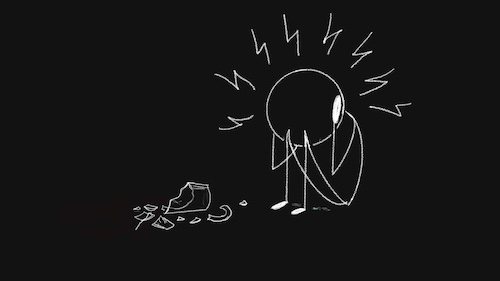

import Footnote from "../../components/footnote";
import AuthorCard from "../../components/authorCard";

The question I struggled with since my cPTSD diagnosis has been: "Why now?". Why did the symptoms start appearing when they did? Why did it become debilitating when it did? What made it become cPTSD? If my hypothesis in my [last post](/blog/faith/) is true, then I may have just gotten an answer.

I saw a therapist for the first time in University. For one session. He asked me about my mother and, I now realise, I immediately shut down. I never went back. Even though I was struggling, I convinced myself therapy was not the answer. So, I just pushed myself further. I wasn't "_that bad_"... I don't know if the cPTSD was always there, not all symptoms were (like the debilitating recurring nightmares after which I am out of commission an entire day), but the hypervigilance and anxiety were always present, maybe others too. But I saw them as good things, they kept me going, pushing me forward. In fact, I was steered by the belief that if only I tried harder I would be safe, loved, happy...

So why now? Well, if cPTSD is indeed the loss of faith as I proposed in my [last post](/blog/faith/), then: it's the point where I stopped believing that, if I tried harder, I will eventually be enough. It took away my last remaining bit of faith, and left me without any.

## Memory and The Difficulty of Setting a Timeline

I remember very little of my childhood. Every memory I have before the age of 10 or so is of my grandfather. There are not many, but they are the only ones I have. It's as if my parents did not exist before that. Sure, there are some other vague memories in there, but I just remember the pictures and other people's stories. But, as far as I can tell, it's as if my parents weren't even there before that, which I logically know not to be true.

Following that... of my school, university and early working career, I remember a more. If you ask me, and me alone, I never got triggered, and had a good experience overall<Footnote presentation="0">... kind of... The only reason I wasn't openly bullied in school was that my mother was a teacher, and late a class teacher, and I don't think anyone really dared. But I was isolated nonetheless.</Footnote>. That is to say, I don't remember getting triggered. Yet, I would get into these awkward situations with people where I would not understand what caused them. Could I have been triggered all along? After all, what is being triggered if not a state of emotional hijacking, or refractory period as Paul Ekman defines it? And, if he is correct, it makes sense that I would not be able to correctly process those times. 

"_During the refractory period, our ability to think is compromised, we see only what fits, and we cannot learn from experience that might disconfirm the emotion. We are unable to remember information that might help us see the situation more accurately._"<Footnote presentation="1">Ekman, P. (2003). Emotions revealed: Recognizing faces and feelings to improve communication and emotional life. New York: Times Books.</Footnote>

So when did my cPTSD _really_ start? I think later, much later. Especially if I am to believe my hypothesis about cPTSD and faith.

## The Straw that Broke the Camel's Back

It was probably the event that got me to properly go to therapy. I was on a team at work that I really enjoyed. It matched my skills greatly, and I could see my impact in a way that made me really happy. I was appreciated by our users, or at least I felt like I was. So, naturally, that only made me work and try harder. Later, after team drinks (a lot of drinks), I was chatting at the hotel bar with the senior engineer on my team, and he talked about how I was working so hard, and that I was so competitive, and it made him feel so bad, like I was trying to undermine him<Footnote presentation="2">Reader, he was 3 promotions ahead of me, I had wasn't even considering it...</Footnote>. 

That came back in my performance review, a month or so later, as "not a team player", which tanked my review from the expected GEE (i.e. did extremely well), to ME (i.e. just did enough). Not a bad review, but based on my work that half, it most certainly felt like it. Everyone outside the team I talked to was surprised, as they too expected that same evaluation, or the one higher.

Why would this be the trigger for my cPTSD? The one belief that I had that kept me going, the one faith that I had was: "_If only I work harder, if only I try harder, if only I am better... then things will be good. People will appreciate me. People will love me..._". In one swoop, it was gone. 

Now, I was by no means a well-adjusted individual. I was in an abusive relationship I could not see because I was comfortable dismissing my own needs, and just trying harder; I was argumentative; my emotional empathy was that of a rock; I could not self regulate my own emotions; I had no idea of my own needs... So, yeah...

But ignorance is bliss, and at least I could keep going. 

And then the nightmares started, and my anxiety turned to outright panic attacks. I once cried on the floor, hyperventilating, rocking myself for maybe an hour over accidentally breaking a mug... I was aware of what I was doing, as it was after starting therapy. But I had no power to stop it. I kept telling myself I was safe, it was just a mug, and a bloody ugly one at that... but to no avail.

So, I went to therapy. We barely scratched the surface. I felt like my problems weren't big enough to bother the therapist with. Was I even aware they were problems? So, we just focused on my perfectionism, and my stress (which was my way of describing my panic attacks). I really didn't give that therapist a fighting chance to help me. But, it started the ball rolling. About a year or so later<Footnote presentation="3">Reader, if there are chronological inconsistencies, please forgive me. That time, partially due to COVID, partially due to my own issues, is a bit fuzzy.</Footnote>, I got diagnosed with cPTSD.

## What Caused my cPTSD?

If we only look at the final straw, then my work is what caused my cPTSD. Simple, right? Well, not really... There were also a few other things that happened in that team, and at that company that honestly still affect me. It's not that they were not traumatic to me. But I can't analyse them in a vacuum. At the time there was also my last relationship... and there was my childhood too... My haystack has been building up for a long time. And that was just the last straw. 

What is to blame for breaking the camel's back? The last straw? First straw? Or the entire haystack? As I talked through things with my therapists, that final straw was the least of my concerns. But it certainly was enough to tip the scales.

I can't deny however, that it had me chasing red herrings in therapy and in my own life for a fairly long time. After all, it wasn't until my very last session with my first therapist that I was even really willing to mention anything about my mother. It prevented me from doing the things I needed to do for a very long time. The best gift my ex ever gave me was breaking up with me, when I started to run on empty and had nothing more to give. It was the final betrayal I needed to take the steps I needed to finally begin to heal. Well, that and a good therapist who didn't let me just stay with the superficial problems. Ok, mostly the therapist. But I did see him because of the break-up and some of the other things that happened in that relationship.

## The Doubt in Timing

One thing I knew needed to do was going no-contact with my parents. I didn't really have the courage, and I doubted the choice. After all, they didn't know any better, they did "their best". But after I gave my mother one last chance to connect, and she turned on me and called me a monster... so, the decision was made, I just needed to find the courage and timing to do it, which still took me a while.

It should have been an obvious decision, after all, whenever we had a video call it would take me a whole day to recover. And on particularly bad calls it could be as long as a week. But still I felt so guilty. Was I punishing her unfairly? Worse was I punishing her for how my company treated me, how my ex treated me? Surely, she wasn't the cause of my pain. She was just clumsy and had a knack for making it worse...

I went back and forth, realising how porous it made my boundaries<Footnote presentation="4">After all we don't even have a word for boundaries in Romanian. The best approximation is "limită", which as you can guess means limit. And that is very much not the same.</Footnote>... Every contact drilled new holes in them. Still, I hesitated. No-contact was no punishment... it was a necessary boundary, a protection of me. And a decision I need to continue making every day. It allowed me to finally live without the need to chase her fickle approval, and to manage the pain I still feel at her dismissal and disapproval. I can be where I am now, doing what I am doing now thanks to it.

## The Loss of Faith

I think I always operated on low faith. I fueled it with my perfectionism and my attempts to control everything around me, making it seem bigger than it actually was. But, at least, I was able to keep going. I had managed to make a breadcrumb into a buffet. Until I lost it all. And then I realised how little I had in the first place. I think other people could see it, it showed in how I related to them, but I couldn't. People could tell I didn't trust them, even if I saw myself as a very trusting person.

I am finally closer to an answer as to "why now?". It was always there. It wasn’t a single moment that caused my cPTSD, that's the primary difference from PTSD after all, but the breaking point came when my coping system failed. When I stopped believing that there will eventually be an enough, if I just tried harder. My last piece of faith.

It may have been the last straw that was too much, but, like a camel, I wasn't meant to be carrying the haystack in the first place. My escape to Korea was a way for me to escape the haystack, and in the end I got just so much more.

<AuthorCard />

---

0 ... kind of... The only reason I wasn't openly bullied in school was that my mother was a teacher, and late a class teacher, and I don't think anyone really dared. But I was isolated nonetheless.

1 Ekman, P. (2003). Emotions revealed: Recognizing faces and feelings
to improve communication and emotional life. New York: Times Books.

2 Reader, he was 3 promotions ahead of me, I had wasn't even considering it...

3 Reader, if there are chronological inconsistencies, please forgive me.
That time, partially due to COVID, partially due to my own issues, is a bit fuzzy.

4 After all we don't even have a word for boundaries in Romanian. The
best approximation is "limită", which as you can guess means limit. And that is very
much not the same.